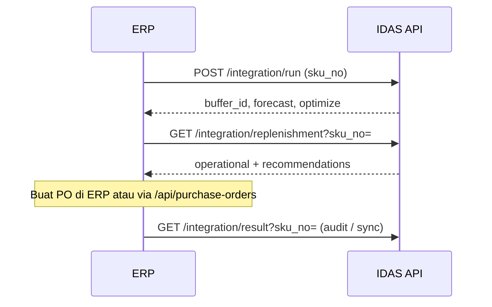

# Panduan API integrasi — SKU No

Dokumen ini untuk **sistem eksternal** (ERP, middleware, batch job) yang memanggil pipeline DDMRP per SKU tanpa melalui UI.

**Aplikasi (UI):** [https://transtrack-ddmrp.skom.my.id](https://transtrack-ddmrp.skom.my.id)  
**Base URL API (produksi):** `https://transtrack-ddmrp-api.skom.my.id`  
**Prefix:** `/api/analytics`

| Lingkungan | Base URL API |
|------------|----------------|
| Produksi | `https://transtrack-ddmrp-api.skom.my.id` |
| Development (Docker lokal) | `http://localhost:8000` |

Semua endpoint integrasi memakai parameter **`sku_no`** (setara `sku` di API internal).

---

## Ringkasan endpoint

| Method | Path | Fungsi |
|--------|------|--------|
| `POST` | `/api/analytics/integration/run` | Forecast + optimize + simpan buffer & latest run |
| `GET` | `/api/analytics/integration/result?sku_no=<SKU_NO>` | Baca latest run (forecast + optimize) |
| `GET` | `/api/analytics/integration/replenishment?sku_no=<SKU_NO>` | Buffer aktif + rekomendasi + snapshot operasional |

**Prasyarat:** SKU harus ada di `sku_master` dan punya data demand (`daily_record`) sebelum `integration/run`.

---

## 1. `POST /api/analytics/integration/run`

Menjalankan pipeline penuh (sama dengan `POST /api/analytics/run`) dengan body berbasis `sku_no`.

### Request

`Content-Type: application/json`

| Field | Wajib | Default | Keterangan |
|-------|-------|---------|------------|
| `sku_no` | ya | — | Kode SKU (string, trim) |
| `sl_target` | tidak | `0.95` | Target service level GA (0.5–0.999) |
| `pop_size` | tidak | `30` | Ukuran populasi GA (6–80) |
| `n_gen` | tidak | `80` | Generasi GA (5–120) |
| `include_baseline` | tidak | `true` | Sertakan perbandingan baseline |

```json
{
  "sku_no": "1000001",
  "sl_target": 0.95,
  "pop_size": 30,
  "n_gen": 80,
  "include_baseline": true
}
```

### Response `200`

```json
{
  "sku_no": "1000001",
  "status": "ok",
  "buffer_id": 123,
  "latest_run_id": 77,
  "forecast": { "...": "..." },
  "optimize": { "...": "..." }
}
```

- `buffer_id` — buffer **Active** yang disimpan.
- `forecast` — model terbaik, metrik, ADU, unit.
- `optimize` — VF/LTF optimal, KPI, TOR/TOY/TOG (di dalam `optimized.kpi`).

### Error umum

| HTTP | Penyebab |
|------|----------|
| `404` | SKU tidak ada atau tidak ada data demand |
| `500` | Kegagalan forecast/GA (detail di body) |

### Contoh cURL

```bash
curl -s -X POST "https://transtrack-ddmrp-api.skom.my.id/api/analytics/integration/run" \
  -H "Content-Type: application/json" \
  -d '{"sku_no":"1000001","sl_target":0.95,"pop_size":30,"n_gen":80}'
```

---

## 2. `GET /api/analytics/integration/result?sku_no=<SKU_NO>`

Mengambil **latest run** tersimpan untuk SKU (tanpa menjalankan ulang pipeline).

### Query

| Parameter | Wajib | Keterangan |
|-----------|-------|------------|
| `sku_no` | ya | Kode SKU |

### Response `200` (ada run)

```json
{
  "sku_no": "1000001",
  "status": "ok",
  "sku": "1000001",
  "latest_run": {
    "id": 77,
    "run_at": "2026-04-08T18:12:34.123456",
    "unit": "PCS",
    "forecast": { "sku": "1000001", "best_model": "...", "adu": 15.43 },
    "optimize": { "sku": "1000001", "optimized": { "fv_opt": 0.1, "ltf_opt": 1.0, "kpi": {} } }
  }
}
```

### Response `200` (belum pernah run)

```json
{
  "sku_no": "1000001",
  "status": "ok",
  "sku": "1000001",
  "latest_run": null
}
```

### Error

| HTTP | Penyebab |
|------|----------|
| `400` | Parameter `sku_no` kosong |

```bash
curl -s "https://transtrack-ddmrp-api.skom.my.id/api/analytics/integration/result?sku_no=1000001"
```

---

## 3. `GET /api/analytics/integration/replenishment?sku_no=<SKU_NO>`

Mengambil rencana replenishment dari **buffer aktif** terakhir, termasuk posisi operasional hari ini.

### Query

| Parameter | Wajib | Keterangan |
|-----------|-------|------------|
| `sku_no` | ya | Kode SKU |

### Response `200`

```json
{
  "sku_no": "1000001",
  "status": "ok",
  "sku": "1000001",
  "unit": "PCS",
  "buffer_id": 123,
  "version": 1,
  "today_date": "2026-04-09",
  "end_date": "2026-04-15",
  "leadtime_days": 7,
  "adu": 15.43,
  "vf_opt": 0.1,
  "ltf_opt": 1.0,
  "tor": 58.0,
  "toy": 196.0,
  "tog": 340.0,
  "operational": {
    "on_hand": 196.0,
    "open_order": 0.0,
    "qualified_demand": 15.4,
    "nfe": 58.45,
    "zone": "YELLOW",
    "suggested_order_qty": 171.0,
    "confirmed_pos": [],
    "unit": "PCS"
  },
  "recommendations": [
    {
      "date": "2026-04-09",
      "order_qty": 12.0,
      "nfe": 3.5,
      "zone": "RED"
    }
  ]
}
```

### Field penting

| Field | Arti |
|-------|------|
| `tor`, `toy`, `tog` | Batas zona buffer (dari RUN 3) |
| `operational.nfe` | NFE operasional hari `today_date` |
| `operational.suggested_order_qty` | Saran qty order setelah OP/QD terkini |
| `operational.confirmed_pos` | PO confirmed yang belum diterima |
| `recommendations[].order_qty` | Saran residual per hari di jendela buffer |

### Error

| HTTP | Penyebab |
|------|----------|
| `404` | Tidak ada buffer Active — jalankan `integration/run` dulu |
| `400` | `sku_no` kosong |

```bash
curl -s "https://transtrack-ddmrp-api.skom.my.id/api/analytics/integration/replenishment?sku_no=1000001"
```

---

## 4. Alur integrasi yang disarankan



1. Pastikan master + demand sudah di-load (UI upload atau impor CLI).
2. `POST /integration/run` untuk SKU yang perlu diperbarui.
3. `GET /integration/replenishment` untuk keputusan order harian.
4. Opsional: konfirmasi PO lewat `POST /api/purchase-orders` lalu panggil lagi replenishment atau `POST /api/analytics/recalc-operational?sku=`.

---

## 5. Endpoint terkait (bukan prefix integrasi)

| Endpoint | Keterangan |
|----------|------------|
| `GET /api/analytics/dataset-status` | Cek kesiapan data |
| `GET /api/analytics/latest-run?sku=` | Sama seperti result, parameter `sku` |
| `GET /api/analytics/replenishment?sku=` | Sama seperti integration replenishment |
| `POST /api/purchase-orders` | PO operasional |
| `POST /api/analytics/recalc-operational?sku=` | Recalc NFE tanpa GA |

---

## 6. Perbedaan parameter `sku` vs `sku_no`

| Konteks | Parameter |
|---------|-----------|
| UI / API internal | `sku` (query atau body `RunBody`) |
| API integrasi | `sku_no` (query atau body `IntegrationRunBody`) |

Nilai dan normalisasi (trim string) sama; hanya nama field yang berbeda untuk kontrak integrasi.

---

## Dokumen terkait

- [USER_MANUAL.md](./USER_MANUAL.md) — panduan UI
- [INSTALLATION.md](./INSTALLATION.md) — instalasi & reset DB
- [../README.md](../README.md) — PO API, scheduler, dashboard
