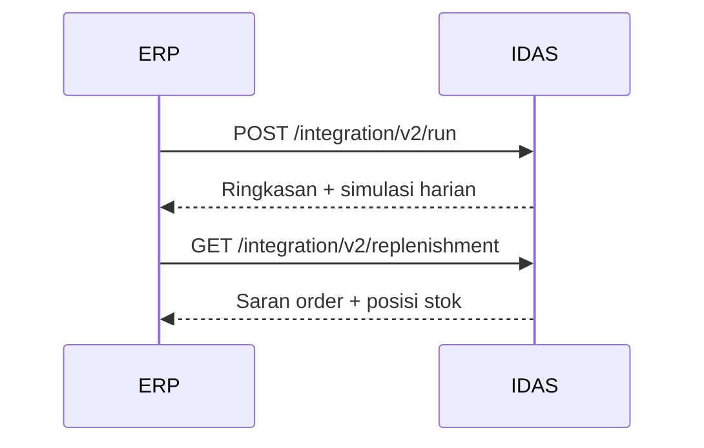

# Panduan API integrasi v2 — IDAS

Dokumen ini untuk **tim yang menghubungkan ERP atau sistem lain ke IDAS** (middleware, job terjadwal, skrip integrasi).

**Aplikasi web (buka di browser):** [https://transtrack-ddmrp.skom.my.id](https://transtrack-ddmrp.skom.my.id)  
**Alamat API (semua contoh perintah di bawah):** `https://transtrack-ddmrp-api.skom.my.id`  
**Awalan path API:** `/api/analytics`

| Untuk apa | URL yang dipakai |
|-----------|------------------|
| Login, Master Data, menu aplikasi | `https://transtrack-ddmrp.skom.my.id` |
| Panggilan API (curl, ERP, integrasi) | `https://transtrack-ddmrp-api.skom.my.id` |
| Pengujian di komputer sendiri (Docker) | `http://localhost:8000` |

> **Penting:** Jangan memanggil `/api/...` lewat alamat aplikasi web — Anda akan mendapat **Not Found (404)** karena itu bukan server API.

Dokumentasi API lengkap (Swagger): [https://transtrack-ddmrp-api.skom.my.id/docs](https://transtrack-ddmrp-api.skom.my.id/docs)

Penjelasan konsep buffer v2 untuk pengguna bisnis: [USER_MANUAL_V2.md](./USER_MANUAL_V2.md).  
Integrasi **versi 1** (lama): [INTEGRATION_API_MANUAL.md](./INTEGRATION_API_MANUAL.md).

---

## Apa yang dilakukan API v2?

Untuk **satu nomor SKU**, API v2 akan:

1. Memastikan data master lengkap (terutama **stok awal**).
2. Mengklasifikasi pola penjualan dan memilih cara hitung buffer yang sesuai.
3. Mencari kombinasi **VF** dan **LTF** terbaik (optimasi otomatis).
4. Menyimpan rencana buffer dan mengembalikan **ringkasan angka** + **simulasi per hari**.

Versi 1 API **tetap ada** dan tidak berubah — gunakan v2 hanya jika Anda sengaja ingin aturan perhitungan baru ini.

---

## Daftar layanan (endpoint)

| Aksi | Cara memanggil | Kapan dipakai |
|------|----------------|---------------|
| **Jalankan** perhitungan buffer v2 | `POST …/integration/v2/run` | Saat SKU perlu diperbarui rencananya |
| **Baca** hasil terakhir | `GET …/integration/v2/result?sku_no=` | Audit, tampilan di ERP tanpa hitung ulang |
| **Ambil** saran order harian | `GET …/integration/v2/replenishment?sku_no=` | Operasional harian setelah buffer v2 aktif |

**Parameter `csv`:** tambahkan `?csv=true` pada **run** atau **result** jika Anda ingin file **CSV** (buka di Excel), bukan JSON.

**Penting:** di Mac/Linux, bungkus URL dengan tanda kutip jika ada tanda `?`:

```bash
curl "https://transtrack-ddmrp-api.skom.my.id/api/analytics/integration/v2/result?sku_no=100008503"
```

---

## Sebelum memanggil API

| Syarat | Keterangan |
|--------|------------|
| SKU ada di **Master Data** | Kode barang terdaftar |
| **Initial Inventory** terisi | Angka stok awal; jika kosong → respons **400** |
| Ada **riwayat penjualan harian** | Data demand per hari untuk SKU itu |

---

## 1. Menjalankan buffer v2

**URL:** `POST https://transtrack-ddmrp-api.skom.my.id/api/analytics/integration/v2/run`  
**Header:** `Content-Type: application/json`

### Isi permintaan (body)

| Field | Wajib? | Nilai awal | Arti |
|-------|--------|------------|------|
| `sku_no` | Ya | — | Nomor SKU |
| `sl_target` | Tidak | `0.95` | Target tingkat layanan (0,5–0,999) |
| `pop_size` | Tidak | `30` | Ukuran populasi optimasi (6–80) |
| `n_gen` | Tidak | `80` | Jumlah iterasi optimasi (minimal 5) |
| `include_baseline` | Tidak | `true` | Sertakan perbandingan dengan setting awal |

```json
{
  "sku_no": "100008503",
  "sl_target": 0.95,
  "pop_size": 30,
  "n_gen": 80,
  "include_baseline": true
}
```

**Target Percentile** (untuk barang pola jarang) diambil dari **Master Data**, bukan dari body permintaan.

### Respons normal (JSON) — kode 200

Tanpa `csv=true`, Anda mendapat ringkasan + tabel harian:

```json
{
  "sku_no": "100008503",
  "status": "ok",
  "api_version": "v2",
  "buffer_id": 12,
  "simulation_summary": {
    "Method": "DDMRP_CONDITIONAL",
    "VF": "0.4750",
    "LTF": "0.3000",
    "Initial Inventory": "2.0",
    "TOR": "0.09",
    "TOY": "0.71",
    "TOG": "1.71",
    "Fill Rate": "100.00%",
    "Total Cost": "Rp3,682,598",
    "Jumlah Order": 3
  },
  "simulation_summary_text": "Method : DDMRP_CONDITIONAL\n…",
  "daily_simulation": [ … ]
}
```

| Bagian respons | Gunanya |
|----------------|---------|
| `simulation_summary` | Angka kunci (format siap tampil) |
| `simulation_summary_text` | Teks satu blok — cocok untuk log atau email |
| `daily_simulation` | Detail per hari (JSON) |
| `buffer_id` | ID rencana buffer yang disimpan |

### Respons CSV — `?csv=true`

File teks dengan kolom: tanggal, permintaan, stok, zona, qty order, TOR, TOY, TOG, dll.  
Cocok untuk dianalisis di Excel.

### Contoh perintah

```bash
# Jalankan dan dapatkan JSON
curl -s -X POST "https://transtrack-ddmrp-api.skom.my.id/api/analytics/integration/v2/run" \
  -H "Content-Type: application/json" \
  -d '{"sku_no":"100008503","pop_size":30,"n_gen":80}'

# Jalankan dan simpan CSV
curl -s -X POST "https://transtrack-ddmrp-api.skom.my.id/api/analytics/integration/v2/run?csv=true" \
  -H "Content-Type: application/json" \
  -d '{"sku_no":"100008503","pop_size":30,"n_gen":80}' \
  -o daily_simulation.csv
```

### Kesalahan yang sering muncul

| Kode | Artinya |
|------|---------|
| **404** + halaman HTML | URL salah — memanggil **aplikasi web**, bukan API | Pakai `https://transtrack-ddmrp-api.skom.my.id` |
| **400** | Initial Inventory kosong di master, atau parameter tidak valid |
| **404** + JSON | SKU tidak ada / belum ada data penjualan |
| **500** | Gagal di tengah proses — lihat pesan di body respons |

---

## 2. Membaca hasil terakhir (tanpa hitung ulang)

**URL:** `GET https://transtrack-ddmrp-api.skom.my.id/api/analytics/integration/v2/result?sku_no=<SKU>`

| Parameter | Wajib? | Keterangan |
|-----------|--------|------------|
| `sku_no` | Ya | Nomor SKU |
| `csv` | Tidak | `true` → unduh CSV simulasi harian |

```bash
curl -s "https://transtrack-ddmrp-api.skom.my.id/api/analytics/integration/v2/result?sku_no=100008503"

curl -s "https://transtrack-ddmrp-api.skom.my.id/api/analytics/integration/v2/result?sku_no=100008503" | jq -r '.simulation_summary_text'

curl -s "https://transtrack-ddmrp-api.skom.my.id/api/analytics/integration/v2/result?sku_no=100008503&csv=true" \
  -o simulasi.csv
```

Jika SKU **belum pernah** dijalankan v2, respons berisi `"latest_run": null`.

Jika hanya pernah v1, respons **404** — jalankan dulu `POST …/v2/run`.

---

## 3. Saran replenishment (order harian)

**URL:** `GET https://transtrack-ddmrp-api.skom.my.id/api/analytics/integration/v2/replenishment?sku_no=<SKU>`

Mengembalikan buffer v2 yang **aktif** (versi diawali `v2-`), posisi operasional hari ini, dan daftar rekomendasi order per tanggal.

```bash
curl -s "https://transtrack-ddmrp-api.skom.my.id/api/analytics/integration/v2/replenishment?sku_no=100008503"
```

Cuplikan respons:

```json
{
  "sku_no": "100008503",
  "status": "ok",
  "api_version": "v2",
  "tor": 0.09,
  "toy": 0.71,
  "tog": 1.71,
  "operational": {
    "on_hand": 2.0,
    "zone": "GREEN"
  },
  "recommendations": [ … ]
}
```

Stok **on hand** operasional mengikuti **Initial Inventory** dari master (bukan TOY).

| Kode | Artinya |
|------|---------|
| **404** | Belum ada buffer v2 aktif — jalankan run v2 dulu |
| **400** | Parameter `sku_no` kosong |

---

## 4. Urutan kerja yang disarankan



1. Pastikan Master Data + demand lengkap (lihat [USER_MANUAL_V2.md](./USER_MANUAL_V2.md)).
2. **POST run** untuk setiap SKU yang perlu diperbarui.
3. **GET replenishment** untuk keputusan order sehari-hari.
4. Opsional: **GET result?csv=true** untuk audit di Excel.

---

## 5. Parameter optimasi & perkiraan waktu

| Parameter | Nilai bawaan | Saran |
|-----------|--------------|-------|
| `pop_size` | 30 | Naikkan jika hasil terasa tidak stabil |
| `n_gen` | 80 | Minimal **5** |
| `sl_target` | 0.95 | Target layanan pelanggan dalam optimasi |

### Perkiraan durasi (satu SKU, `pop_size=30`, `n_gen=80`)

Diukur pada dataset **Data 2 June** (lingkungan referensi, 2026-06):

| SKU | Kategori | Perkiraan waktu |
|-----|----------|-----------------|
| `100006303` | SMOOTH | ~20–30 detik |
| `100008503` | INTERMITTENT | ~30–40 detik |
| `100005106` | LUMPY | ~25–35 detik |

**Panduan operasional:**

- Satu SKU dengan parameter bawaan: rencanakan **±1 menit** termasuk forecast.
- Batch 45 SKU dengan default: rencanakan **±30–45 menit**; jalankan di luar jam puncak.
- Untuk uji cepat: `pop_size=8`, `n_gen=5` (±5–15 detik per SKU, hasil kurang stabil).

Proses yang lebih lama dari perkiraan di atas biasanya karena deret demand panjang atau server sedang sibuk.

---

## 6. Pindah dari API v1 ke v2

| v1 | v2 |
|----|-----|
| Path `…/integration/run` | Path `…/integration/v2/run` |
| Field `fv_opt` | Tidak ada — gunakan angka di `simulation_summary` |
| Respons `forecast` + `optimize` | `simulation_summary` + `daily_simulation` |
| Stok awal operasional = TOY | Stok awal = **Initial Inventory** |

v1 dan v2 dapat dipakai bersamaan selama masa transisi.

---

## Dokumen terkait

- [USER_MANUAL_V2.md](./USER_MANUAL_V2.md) — penjelasan buffer v2 untuk pengguna bisnis
- [INTEGRATION_API_MANUAL.md](./INTEGRATION_API_MANUAL.md) — API integrasi versi 1
- [USER_MANUAL.md](./USER_MANUAL.md) — panduan menu aplikasi web
