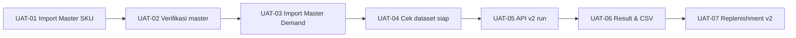

# Skenario UAT — Buffer v2 (Master SKU → Master Demand → API Integrasi v2)

**Produk:** IDAS — Inventory Decision Analytic System  
**Fitur diuji:** Import Master SKU (21 kolom) + Master Demand + simulasi buffer lewat **API integrasi v2**  
**Versi dokumen:** 1.0 (2026-07-03)

---

## 1. Ringkasan

UAT ini memastikan pengguna dapat:

1. Mengunggah **Master SKU** (termasuk Initial Inventory, Qmax, Target Percentile).
2. Mengunggah **Master Demand** (riwayat penjualan harian).
3. Menjalankan **simulasi buffer v2** lewat API dan menerima ringkasan + simulasi harian.

| Lingkungan | URL |
|------------|-----|
| Aplikasi web | [https://transtrack-ddmrp.skom.my.id](https://transtrack-ddmrp.skom.my.id) |
| API integrasi | [https://transtrack-ddmrp-api.skom.my.id](https://transtrack-ddmrp-api.skom.my.id) |

**Data uji acuan:** `resources_ext/Data 2 June.csv` (master, 45 SKU) dan `resources_ext/Data 2 June.xlsx` (sheet `sales` untuk demand).

---

## 2. Peran & tanggung jawab

| Peran | Tanggung jawab UAT |
|-------|-------------------|
| **Admin data** | Skenario import Master SKU & Demand (UI) |
| **Tim IT / integrasi** | Skenario API v2 (run, result, CSV, replenishment) |
| **Perencana persediaan** | Validasi isi `simulation_summary` & CSV di Excel |
| **Penanggung jawab UAT** | Menandatangani lembar sign-off (§10) |

---

## 3. Prasyarat

| # | Prasyarat | Cara cek |
|---|-----------|----------|
| P-01 | Aplikasi web dapat diakses | Buka [Dashboard](https://transtrack-ddmrp.skom.my.id/) |
| P-02 | API dapat diakses | `curl -s https://transtrack-ddmrp-api.skom.my.id/api/analytics/dataset-status` → JSON |
| P-03 | File uji tersedia | `Data 2 June.csv`, `Data 2 June.xlsx` |
| P-04 | Browser & alat uji | Chrome/Edge; Postman atau terminal `curl` |
| P-05 | (Opsional) Lingkungan bersih | Koordinasi admin DB jika perlu reset data uji |

**SKU acuan untuk skenario positif:**

| SKU | Pola | Metode v2 yang diharapkan |
|-----|------|---------------------------|
| `100006303` | SMOOTH | DDMRP |
| `100008503` | INTERMITTENT | DDMRP_CONDITIONAL |
| `100005106` | LUMPY | DDMRP_CONDITIONAL |

---

## 4. Alur UAT (gambaran)



---

## 5. Skenario uji

### UAT-01 — Import Master SKU (UI)

| Item | Detail |
|------|--------|
| **Tujuan** | Master SKU 21 kolom tersimpan, termasuk kolom v2 |
| **Peran** | Admin data |
| **Pra-kondisi** | P-01, P-03 |

**Langkah:**

| Step | Aksi | Hasil yang diharapkan |
|------|------|------------------------|
| 1 | Buka [Master Data](https://transtrack-ddmrp.skom.my.id/master) | Halaman daftar SKU terbuka |
| 2 | Unduh template master SKU (tombol di UI) | File Excel/CSV template terunduh |
| 3 | Unggah `Data 2 June.csv` (atau Excel setara 21 kolom) | Pesan sukses; tidak ada error validasi fatal |
| 4 | Cari SKU `100008503` di tabel | SKU muncul |
| 5 | Periksa kolom **Initial Inventory** | Nilai = `2` (atau sesuai file uji) |
| 6 | Periksa **Target Percentile** | `98%` / `0.98` |
| 7 | Periksa **Qmax** | `1` (atau sesuai file uji) |

**Kriteria lulus:** Minimal 45 SKU terlihat; SKU `100008503` punya Initial Inventory terisi.

**Catatan tester:** _______________________________

---

### UAT-02 — Verifikasi Master SKU (API opsional)

| Item | Detail |
|------|--------|
| **Tujuan** | Master terbaca backend sebelum demand & simulasi |
| **Peran** | Tim IT |

```bash
curl -s "https://transtrack-ddmrp-api.skom.my.id/api/master/skus" | head -c 500
```

**Kriteria lulus:** Respons JSON berisi array `skus`; SKU `100008503` ada dengan `initial_inventory` tidak null.

---

### UAT-03 — Import Master Demand (UI)

| Item | Detail |
|------|--------|
| **Tujuan** | Riwayat penjualan harian tersimpan untuk SKU uji |
| **Peran** | Admin data |
| **Pra-kondisi** | UAT-01 lulus |

**Langkah:**

| Step | Aksi | Hasil yang diharapkan |
|------|------|------------------------|
| 1 | Buka [Master Demand](https://transtrack-ddmrp.skom.my.id/master/demand) | Halaman demand terbuka |
| 2 | Unggah file demand dari `Data 2 June.xlsx` (sheet sales) atau format: `Date`, `ID Item`, `Demand` | Pesan sukses |
| 3 | Filter/cari SKU `100008503` | Ada baris demand (banyak tanggal) |
| 4 | Pastikan tidak ada SKU di demand yang tidak ada di master | Tidak ada error referensi SKU |

**Kriteria lulus:** Demand untuk `100008503` terlihat; jumlah baris > 0.

**Catatan tester:** _______________________________

---

### UAT-04 — Dataset siap untuk simulasi

| Item | Detail |
|------|--------|
| **Tujuan** | Sistem melaporkan data siap forecast/simulasi |
| **Peran** | Tim IT |

```bash
curl -s "https://transtrack-ddmrp-api.skom.my.id/api/analytics/dataset-status"
```

**Kriteria lulus:**

| Field | Nilai yang diharapkan |
|-------|----------------------|
| `ready_for_forecast` | `true` |
| `master_rows` | ≥ 45 |
| `skus_with_demand` | ≥ 1 (idealnya 45) |

---

### UAT-05 — Jalankan simulasi buffer v2 (API run)

| Item | Detail |
|------|--------|
| **Tujuan** | Simulasi v2 berhasil untuk SKU INTERMITTENT |
| **Peran** | Tim IT |
| **Pra-kondisi** | UAT-01, UAT-03, UAT-04 lulus |

```bash
curl -s -X POST "https://transtrack-ddmrp-api.skom.my.id/api/analytics/integration/v2/run" \
  -H "Content-Type: application/json" \
  -d '{"sku_no":"100008503","sl_target":0.95,"pop_size":30,"n_gen":80}'
```

**Kriteria lulus (periksa respons JSON):**

| Field | Yang diharapkan |
|-------|-----------------|
| HTTP status | `200` |
| `status` | `"ok"` |
| `api_version` | `"v2"` |
| `buffer_id` | Angka > 0 |
| `simulation_summary.Method` | `DDMRP_CONDITIONAL` |
| `simulation_summary["Initial Inventory"]` | `"2.0"` (atau sesuai master) |
| `simulation_summary["Fill Rate"]` | Terformat persen, mis. `100.00%` |
| `simulation_summary["Total Cost"]` | Format `Rp…` |
| `daily_simulation` | Array tidak kosong |

**Waktu respons:** catat durasi (target referensi ±30–60 detik untuk SKU ini).

| Durasi aktual (detik) | Catatan |
|-----------------------|---------|
| | |

Ulangi untuk SKU `100006303` (harapan `DDMRP`) dan `100005106` (harapan `DDMRP_CONDITIONAL`) jika waktu memungkinkan.

---

### UAT-06 — Baca hasil & export CSV

| Item | Detail |
|------|--------|
| **Tujuan** | Hasil tersimpan; CSV bisa dibuka di Excel |
| **Peran** | Tim IT + Perencana |
| **Pra-kondisi** | UAT-05 lulus untuk `100008503` |

**6a — Result JSON**

```bash
curl -s "https://transtrack-ddmrp-api.skom.my.id/api/analytics/integration/v2/result?sku_no=100008503"
```

**Kriteria lulus:** `api_version` = `v2`; `simulation_summary` ada; `latest_run` tidak null.

**6b — Ringkasan teks**

```bash
curl -s "https://transtrack-ddmrp-api.skom.my.id/api/analytics/integration/v2/result?sku_no=100008503" \
  | python3 -c "import json,sys; print(json.load(sys.stdin).get('simulation_summary_text','')[:400])"
```

**Kriteria lulus:** Teks berisi baris `Method :`, `TOR`, `Total Cost`.

**6c — Export CSV**

```bash
curl -s "https://transtrack-ddmrp-api.skom.my.id/api/analytics/integration/v2/result?sku_no=100008503&csv=true" \
  -o uat_simulasi_100008503.csv
```

| Step | Aksi | Hasil yang diharapkan |
|------|------|------------------------|
| 1 | Buka `uat_simulasi_100008503.csv` di Excel | Kolom: `date`, `demand`, `nfe`, `zone`, `order_qty`, `TOR`, `TOY`, `TOG`, dll. |
| 2 | Periksa baris pertama data | Tanggal dan angka terbaca normal |
| 3 | Perencana: bandingkan beberapa hari dengan ekspektasi bisnis | Masuk akal (tidak semua kosong/error) |

**Kriteria lulus:** File CSV valid; ≥ 1 baris data harian.

---

### UAT-07 — Replenishment v2

| Item | Detail |
|------|--------|
| **Tujuan** | Saran order harian dari buffer v2 aktif |
| **Peran** | Tim IT |
| **Pra-kondisi** | UAT-05 lulus |

```bash
curl -s "https://transtrack-ddmrp-api.skom.my.id/api/analytics/integration/v2/replenishment?sku_no=100008503"
```

**Kriteria lulus:**

| Field | Yang diharapkan |
|-------|-----------------|
| HTTP status | `200` |
| `api_version` | `"v2"` |
| `version` | Diawali `v2-` |
| `tor`, `toy`, `tog` | Angka > 0 (sesuai simulasi) |
| `operational.on_hand` | Sesuai Initial Inventory master (`2`) |
| `recommendations` | Array (boleh ada hari dengan `order_qty` = 0) |

---

### UAT-08 — Skenario negatif: Initial Inventory kosong

| Item | Detail |
|------|--------|
| **Tujuan** | Sistem menolak run v2 jika stok awal kosong |
| **Peran** | Tim IT |
| **Pra-kondisi** | Ada SKU uji tanpa Initial Inventory (buat SKU fiktif atau kosongkan sementara di master) |

```bash
curl -s -X POST "https://transtrack-ddmrp-api.skom.my.id/api/analytics/integration/v2/run" \
  -H "Content-Type: application/json" \
  -d '{"sku_no":"<SKU_TANPA_INITIAL_INV>","pop_size":8,"n_gen":5}'
```

**Kriteria lulus:** HTTP `400`; pesan menyebut `initial_inventory`.

---

### UAT-09 — Skenario negatif: URL API salah

| Item | Detail |
|------|--------|
| **Tujuan** | Memastikan kesalahan umum teridentifikasi |
| **Peran** | Tim IT |

```bash
curl -s -o /dev/null -w "%{http_code}" -X POST \
  "https://transtrack-ddmrp.skom.my.id/api/analytics/integration/v2/run" \
  -H "Content-Type: application/json" \
  -d '{"sku_no":"100008503","pop_size":8,"n_gen":5}'
```

**Kriteria lulus:** HTTP `404` (memanggil **aplikasi web**, bukan API).

**Tindakan benar:** Gunakan `https://transtrack-ddmrp-api.skom.my.id`.

---

### UAT-10 — Skenario negatif: SKU tanpa demand

| Item | Detail |
|------|--------|
| **Tujuan** | SKU di master tanpa penjualan ditolak |
| **Peran** | Tim IT |

Gunakan SKU yang ada di master tetapi **tidak** punya baris demand.

**Kriteria lulus:** HTTP `404` atau pesan SKU/demand tidak ditemukan.

---

## 6. Matriks ringkas

| ID | Skenario | Metode | Prioritas | Lulus? |
|----|----------|--------|-----------|--------|
| UAT-01 | Import Master SKU | UI | Tinggi | ☐ |
| UAT-02 | Verifikasi master API | API | Sedang | ☐ |
| UAT-03 | Import Master Demand | UI | Tinggi | ☐ |
| UAT-04 | Dataset status | API | Tinggi | ☐ |
| UAT-05 | Run simulasi v2 | API | Tinggi | ☐ |
| UAT-06 | Result + CSV Excel | API + manual | Tinggi | ☐ |
| UAT-07 | Replenishment v2 | API | Tinggi | ☐ |
| UAT-08 | Negatif: no initial inv | API | Sedang | ☐ |
| UAT-09 | Negatif: URL salah | API | Sedang | ☐ |
| UAT-10 | Negatif: no demand | API | Rendah | ☐ |

---

## 7. Kriteria penerimaan keseluruhan

UAT **dinyatakan lulus** jika:

- [ ] UAT-01, UAT-03, UAT-04, UAT-05, UAT-06, UAT-07 **lulus**
- [ ] SKU `100008503` menghasilkan `DDMRP_CONDITIONAL` dan `simulation_summary` lengkap
- [ ] CSV simulasi harian dapat dibuka di Excel tanpa error parsing
- [ ] Replenishment v2 memakai buffer versi `v2-…`
- [ ] Skenario negatif UAT-08 dan UAT-09 perilakunya sesuai dokumentasi

---

## 8. Defect log (contoh)

| No | ID UAT | Deskripsi | Severity | Status |
|----|--------|-----------|----------|--------|
| 1 | | | Major / Minor | Open / Fixed |
| 2 | | | | |

---

## 9. Referensi

| Dokumen | Isi |
|---------|-----|
| [USER_MANUAL_V2.md](./USER_MANUAL_V2.md) | Konsep buffer v2 untuk pengguna |
| [INTEGRATION_API_MANUAL_V2.md](./INTEGRATION_API_MANUAL_V2.md) | Detail API v2 |
| [USER_MANUAL.md](./USER_MANUAL.md) | Import master & demand (UI) |

---

## 10. Sign-off

| Peran | Nama | Tanggal | Tanda tangan |
|-------|------|---------|--------------|
| Admin data | | | |
| Tim IT / integrasi | | | |
| Perencana persediaan | | | |
| Penanggung jawab UAT | | | |

**Keputusan akhir:** ☐ Diterima  ☐ Diterima dengan catatan  ☐ Ditolak

**Catatan:** _______________________________________________________________
