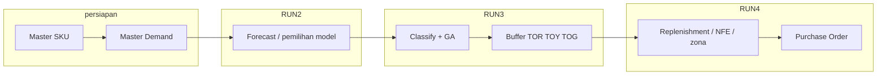
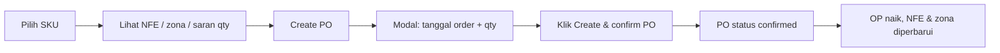

# Panduan pengguna — IDAS (DDMRP)

**IDAS** (*Inventory Decision Analytic System*) adalah aplikasi web untuk perencanaan persediaan berbasis **DDMRP hybrid** (forecast → buffer + GA → replenishment → purchase order operasional).

**Aplikasi (produksi):** [https://transtrack-ddmrp.skom.my.id](https://transtrack-ddmrp.skom.my.id)

| Lingkungan | URL |
|------------|-----|
| Produksi | https://transtrack-ddmrp.skom.my.id |
| Development (Docker lokal) | http://localhost:3001 |

---

## 1. Navigasi aplikasi

| Menu | Path | URL produksi |
|------|------|----------------|
| Dashboard | `/` | https://transtrack-ddmrp.skom.my.id/ |
| Master Data | `/master` | https://transtrack-ddmrp.skom.my.id/master |
| Master Demand | `/master/demand` | https://transtrack-ddmrp.skom.my.id/master/demand |
| Analytics & Buffer | `/analytics` | https://transtrack-ddmrp.skom.my.id/analytics |
| Replenishment | `/replenishment` | https://transtrack-ddmrp.skom.my.id/replenishment |
| Purchase Orders | `/purchase-orders` | https://transtrack-ddmrp.skom.my.id/purchase-orders |

Semua kuantitas perencanaan dalam **PCS / EA** (satu unit per SKU dari master).

---

## 2. Alur pipeline (RUN 2 → 3 → 4)

Pipeline IDAS mengikuti notebook acuan `DDMRP_Hybrid_Algorithm_Last_Version.ipynb`. Setiap **RUN** punya peran berbeda; RUN 2–3 dijalankan dari **Analytics & Buffer**, RUN 4 dari **Replenishment**.

### Gambaran keseluruhan



| RUN | Halaman UI | Apa yang terjadi | Output utama |
|-----|------------|------------------|--------------|
| **—** | Master Data, Master Demand | Data induk & riwayat penjualan | SKU, lead time, MOQ, demand harian |
| **2** | Analytics — Forecast | Pemilihan model deret waktu terbaik | Model, metrik (MAE/RMSE/MAPE), ADU, deret forecast |
| **3** | Analytics — Classify & GA | Klasifikasi ADI–CV², optimasi VF/LTF, simulasi buffer | TOR, TOY, TOG, KPI biaya & fill rate |
| **4** | Replenishment | Rekomendasi order per hari dalam jendela lead time | `order_qty`, NFE, zona (RED/YELLOW/GREEN) per tanggal |

### RUN 2 — Forecast

- Membaca demand historis SKU dari database.
- Membandingkan beberapa model (ensemble, regresi, dll.) dan memilih yang terbaik.
- Menghasilkan **ADU** (average daily usage) dan forecast untuk horizon perencanaan.
- Di UI: tombol **Forecast only**, atau otomatis sebagai langkah pertama **Run full pipeline**.

### RUN 3 — Classify & GA (buffer)

- Mengklasifikasi pola demand (ADI–CV²).
- Menjalankan **genetic algorithm (GA)** untuk mencari kombinasi **VF** (variability factor) dan **LTF** (lead time factor) optimal.
- Mensimulasikan buffer DDMRP dan menghitung **TOR** (top of red), **TOY** (top of yellow), **TOG** (top of green).
- Hasil disimpan sebagai buffer **Active** (`ddmrp_buffer` + detail per hari).
- **On Hand operasional**: untuk SKU yang **baru pertama kali** dibuatkan buffer, diinisialisasi = **TOY**. Untuk SKU yang **sudah** punya buffer sebelumnya, OH **dibawa terus** dari posisi terakhir (termasuk PO yang sudah diterima) — lihat [§5](#po-dan-run-ulang-buffer).
- Di UI: **Optimize (GA)** (butuh forecast sebelumnya) atau bagian dari **Run full pipeline**.

**Pakai forecast atau tidak** — di modal **Edit SKU** (Master Data) ada toggle **Use forecast**:

- **Aktif (default)** — RUN 2+3 memakai forecast statistik sebagai dasar simulasi buffer.
- **Nonaktif** — buffer dihitung langsung dari demand aktual (tanpa bergantung pada forecast untuk simulasi), memakai mesin buffer v2. Forecast tetap dijalankan untuk info model di tab **Forecasting**, tapi tidak menentukan TOR/TOY/TOG.
- Berlaku untuk **Run full pipeline** di Analytics & Buffer maupun scheduler harian — hasilnya tetap tersimpan sebagai buffer **Active** biasa, tidak ada perbedaan di halaman Replenishment.

> **Catatan:** Dalam simulasi GA (RUN 3), **open order** sudah dimodelkan di dalam mesin simulasi. Itu berbeda dari **PO operasional** di RUN 4 (lihat bagian Purchase order).

### RUN 4 — Replenishment

- Membaca buffer **Active** terakhir untuk SKU.
- Menampilkan jendela order dari `start_date` sampai `start_date + lead_time − 1` hari.
- Setiap baris: tanggal, **order_qty** (saran), **NFE**, **zona**.
- Menambahkan blok **operasional** (hari pertama jendela): OH, OP, QD, NFE, zona, **suggested_order_qty**, daftar PO confirmed.

### Kapan menjalankan ulang pipeline?

| Situasi | Tindakan |
|---------|----------|
| SKU baru / demand baru diunggah | **Run full pipeline** untuk SKU tersebut |
| Hanya ingin memperbarui posisi harian (OH/PO/QD) | **Recalc & refresh** di Replenishment (tanpa GA) |
| Parameter GA / service level berubah | **Run full pipeline** lagi — perhatikan dampak PO ([§5](#po-dan-run-ulang-buffer)) |
| Scheduler harian (01:00) | Backend menjalankan forecast + optimize untuk semua SKU aktif — sama dampaknya pada PO |

### Scheduler harian (otomatis)

Backend dapat menjalankan **RUN 2 + 3** untuk semua SKU aktif setiap hari (default **01:00** WIB). Status terlihat di widget **Status sistem** di Dashboard. Ini **tidak** membuat PO; PO tetap manual dari Replenishment.

---

## 3. Alur kerja standar

```
Master SKU  →  Master Demand  →  Analytics RUN 2–3  →  Replenishment RUN 4  →  Purchase Order
```

### Langkah 1 — Master SKU

**Satu SKU (modal):**

1. Buka **Master Data** → tombol **+ New SKU**, atau klik baris SKU di tabel untuk **Edit**.
2. Isi field wajib (Material Number, Material Group, Unit, Lead Time_Days, MOQ, Sales Price, Purchase Price, Holding Cost Rate/day, Lost Sale Rate/Each, Order Cost, Initial Inventory, Target Service Level).
3. **Vendor Type** berupa pilihan **Local** / **Import**. **Holding Cost/day (IDR)** dan **Penalty/unit (IDR)** dihitung otomatis (rate × harga) dan ditampilkan read-only, bukan input.
4. Toggle **Use forecast** menentukan pipeline yang dipakai Analytics & Buffer untuk SKU ini — lihat [§2](#2-alur-pipeline-run-2--3--4).
5. Klik **Save changes**.

> Field **Criticality**, **ABC Class**, **XYZ Class**, dan **Qmax** tidak lagi ada di form manual (tetap tersimpan kalau sebelumnya diisi lewat upload Excel, dan tetap bisa diisi lewat upload Excel). **Qmax** juga disembunyikan karena nilainya konstan.

**Banyak SKU sekaligus (Bulk Upload):**

1. Buka **Master Data** → tab **Bulk Upload**.
2. Unduh template lewat tautan di langkah 1 (atau `GET /api/master/template/master-sku`).
3. Isi Excel (kolom wajib ditandai badge biru: Material Number, Material Group, Lead Time_Days, Sales Price, Purchase Price, Holding Cost Rate/day, Lost Sale Rate/Each, Logistic Cost/Order, MOQ; kolom lain opsional).
4. Drag & drop atau pilih file (`.xlsx`/`.xls`) — langkah 2 menampilkan ringkasan total/valid/error baris.
5. Klik **Save valid rows** — SKU baru **insert**, kode yang sudah ada **update**.

**Tips:** Status **Active** diperlukan agar SKU ikut pipeline analytics.

### Langkah 2 — Master Demand

**Satu baris (modal):** tombol **+ New demand** di halaman Master Demand, atau klik baris di tabel demand untuk **Edit** — isi SKU, tanggal, demand, dan promo discount (opsional, dalam persen).

**Banyak baris (upload):**

1. Buka **Master Demand**.
2. Unggah file demand (format `Date`, `ID Item` / `SKU`, `Demand`; `.xlsx`, `.xls`, atau `.csv`).
3. Pilih mode simpan: **insert new rows only** (lewati tanggal+SKU yang sudah ada) atau **overwrite existing rows**.
4. Setelah unggah, cek di **Analytics** bahwa dataset status menunjukkan data siap.

### Langkah 3 — Analytics & Buffer (RUN 2 + 3)

Lihat [§2 Alur pipeline](#2-alur-pipeline-run-2--3--4) untuk detail tiap RUN.

1. Buka **Analytics & Buffer**.
2. Pilih SKU dari daftar.
3. Jalankan salah satu:
   - **Forecast only** — pemilihan model deret waktu.
   - **Optimize (GA)** — setelah forecast, optimasi VF/LTF dan TOR/TOY/TOG.
   - **Run full pipeline** — forecast + optimize sekaligus (disarankan pertama kali).

Parameter GA (service level, populasi, generasi) bisa disesuaikan di UI sebelum run.

**Hasil:**

- Model forecast terbaik, ADU, metrik.
- Klasifikasi ADI–CV², buffer optimal, KPI simulasi.
- Buffer **Active** tersimpan di database; state operasional disiapkan — on-hand awal = TOY hanya untuk SKU baru, kalau tidak OH lama dibawa terus (lihat catatan RUN 3 di atas).

### Langkah 4 — Replenishment (RUN 4)

1. Buka **Replenishment**.
2. Pilih SKU (hanya yang punya buffer aktif).
3. Lihat:
   - **TOR / TOY / TOG** — batas zona buffer.
   - **Posisi operasional** — On Hand, Open Order, NFE, zona, saran qty.
   - **Jendela order** — rekomendasi per hari dalam horizon lead time.

4. **Recalc & refresh** — perbarui NFE dari demand/forecast/PO terkini tanpa menjalankan ulang GA.
5. **Create PO** — tombol per SKU, atau tombol **Create PO** di kolom **Action** untuk baris zona RED/YELLOW — modal tanggal + qty, lalu **Create & confirm PO** (langsung status confirmed).
6. **Export CSV** — unduh saran order dan PO confirmed.

> Halaman ini sengaja disederhanakan: widget ringkasan (zona merah/kuning/hijau, total order hari ini, confirmed PO), panel **Quick actions**, dan **riwayat PO** tidak ditampilkan di sini. Untuk melihat/mengelola semua PO (termasuk riwayat, confirm/receive/cancel manual), buka halaman **Purchase Orders** ([§5](#5-purchase-order-loop-operasional)). Angka di tabel tidak menampilkan satuan, dan NFE selalu bulat.

---

## 4. Dashboard (Beranda)

Menampilkan ringkasan dari buffer aktif semua SKU:

| KPI | Arti |
|-----|------|
| Total SKU | Jumlah SKU dengan buffer aktif |
| Red zone | SKU dengan NFE di zona merah hari ini |
| Needs replenishment | SKU dengan saran order > 0 |
| Confirmed PO | SKU dengan PO confirmed yang belum diterima — kartu ini bisa **diklik**, langsung membuka halaman **Purchase Orders** |

**Tabel prioritas kritis** — hingga 5 SKU zona merah, diurutkan defisit NFE. Tautan **View all** membuka **modal** berisi seluruh SKU lintas zona langsung di halaman ini (tidak lagi berpindah ke Replenishment).

**Status sistem** — scheduler refresh harian (default 01:00), job nightly terakhir. Refresh malam menjalankan **RUN 2 + 3** untuk semua SKU aktif — lihat [§5 PO dan run ulang buffer](#po-dan-run-ulang-buffer) jika ada PO confirmed.

---

## 5. Purchase order (loop operasional)

Setelah **RUN 3** menghasilkan buffer aktif, tim operasional dapat mengonfirmasi rekomendasi sebagai **Purchase Order (PO)**. PO adalah langkah **setelah RUN 4** — mengubah perhitungan harian **tanpa** menjalankan ulang GA.

### Dua lapisan “open order”

| Lapisan | Kapan dipakai | Keterangan |
|---------|---------------|------------|
| **Simulasi (RUN 3)** | Saat optimasi GA | Open order di dalam mesin simulasi buffer |
| **Operasional (RUN 4+)** | Setelah buffer aktif | PO confirmed di aplikasi; mempengaruhi NFE harian |

Panduan ini fokus pada **PO operasional**.

### Rumus posisi buffer (operasional)

```
NFE = On Hand (OH) + Open Order (OP) − Qualified Demand (QD)
```

| Komponen | Arti di UI / Replenishment |
|----------|---------------------------|
| **OH** | Stok fisik operasional (`on_hand`) |
| **OP** | Total qty PO **confirmed** yang masih dihitung terbuka (`open_order`) — di UI tidak ada langkah “terima barang”; PO confirmed tetap masuk OP sampai dihapus/diganti di luar aplikasi atau lewat API teknis |
| **QD** | Demand hari ini + forecast horizon (jika di atas ADU) |
| **NFE** | Net flow equation — dibandingkan ke TOR/TOY/TOG untuk zona |
| **TOR / TOY / TOG** | Batas zona; tetap dari RUN 3 sampai pipeline dijalankan ulang |

**Zona buffer:**

| Zona | Kondisi (sederhana) |
|------|---------------------|
| **RED** | NFE di bawah TOR — perlu perhatian segera |
| **YELLOW** | NFE antara TOR dan TOY |
| **GREEN** | NFE di atas TOY |

### Dua cara membuat PO

**Cepat, dari Replenishment** — satu klik langsung confirmed:



| Langkah | Di layar |
|---------|----------|
| 1 | Pilih SKU yang punya buffer aktif di **Replenishment** |
| 2 | Periksa **Posisi operasional** (On Hand, Open Order, NFE, zona) di kartu **Current buffer position** |
| 3 | Klik **Create PO** di kolom **Action** pada baris zona **RED** / **YELLOW** di tabel jadwal |
| 4 | Di modal: pilih **tanggal order**, sesuaikan **qty** (dibulatkan ke **MOQ** dari master) |
| 5 | Klik **Create & confirm PO** — PO langsung tercatat **confirmed** (bukan dua langkah terpisah di UI) |
| 6 | Setelah sukses: **Open order** naik, **NFE** dan zona diperbarui, notifikasi hijau menampilkan nomor PO |

Opsi **Force create** (checkbox di modal, jika tidak ada saran order): melewati aturan “satu PO confirmed per SKU per hari order” — untuk uji saja.

**Lengkap, dari halaman Purchase Orders** (`/purchase-orders`) — kelola seluruh siklus hidup PO lintas SKU:

| Aksi | Keterangan |
|------|------------|
| Filter | Per SKU dan/atau status (`draft`/`confirmed`/`received`/`cancelled`) |
| **Confirm** | Untuk PO `draft` |
| **Receive now** | Terima manual untuk PO `confirmed` (biasanya tidak perlu — lihat **Auto-receive** di bawah) |
| **Cancel** | Untuk PO `draft` atau `confirmed` |
| **Check auto-receive now** | Trigger manual sweep auto-receive (job background jalan otomatis tiap 30 menit) |

### Auto-receive

PO **confirmed** otomatis berubah menjadi **received** — OP turun, OH naik — begitu `expected_receipt_date` (tanggal order + lead time) melewati hari acuan buffer aktif SKU tersebut. Tidak perlu klik apa pun; berjalan lewat job background (default tiap 30 menit) dan setiap kali halaman Purchase Orders / Replenishment / Dashboard dimuat. Widget kecil di halaman Purchase Orders menampilkan status job (aktif/tidak, jadwal berikutnya, hasil sweep terakhir).

### Status PO

| Status | Arti untuk operasi harian |
|--------|---------------------------|
| **draft** | Belum dikonfirmasi — belum memengaruhi Open order |
| **confirmed** | **Memengaruhi Open order** dan NFE; menunggu diterima (manual atau auto-receive) |
| **received** | Sudah masuk stok (**On Hand**); tidak lagi dihitung sebagai Open order |
| **cancelled** | Dibatalkan; tidak memengaruhi OH/OP |

### PO dan run ulang buffer

**Run ulang buffer** = menjalankan lagi **Run full pipeline** di Analytics, scheduler harian (01:00), atau API integrasi `POST /api/analytics/integration/run`. Ini **bukan** tombol **Recalc & refresh**.

| Aspek | Setelah run ulang buffer |
|--------|---------------------------|
| **Record PO di database** | Tetap ada — tidak otomatis dibatalkan |
| **Buffer lama** | Status **Archived**; buffer **Active** baru (ID baru) |
| **TOR / TOY / TOG** | Berubah (hasil GA/simulasi terbaru) |
| **On Hand (OH)** | **Dibawa terus** dari posisi terakhir (termasuk PO yang sudah diterima) — **tidak** direset ke TOY buffer baru |
| **Open order (OP)** | Qty PO **confirmed** yang belum jatuh tempo tetap dijumlah dalam NFE, terhadap buffer yang baru |
| **Auto-receive** | Tetap mengevaluasi PO `confirmed` yang lama terhadap hari acuan buffer **aktif saat ini** — PO tidak “terlewat” hanya karena buffernya sudah di-archive |
| **Jadwal order per hari** | Baris tabel = hasil simulasi baru, bukan salinan PO lama |

**Catatan kecil yang masih berlaku:** kartu **Posisi operasional** di Replenishment (`operational.confirmed_pos`) hanya menampilkan PO yang `buffer_id`-nya cocok dengan buffer **aktif saat ini** — PO lama yang dibuat sebelum run ulang bisa tidak muncul di daftar pendek ini walau tetap benar dihitung di total **Open order**. Untuk melihat semua PO apa adanya (termasuk yang terikat buffer lama), buka halaman **Purchase Orders**.

### Aturan bisnis

- SKU harus punya buffer **Active** (sudah RUN 3).
- Qty order dibulatkan ke kelipatan **MOQ** (dan `pack_size` master, biasanya 1).
- **Tanggal terima perkiraan** = tanggal order + **lead time** (hari dari master SKU).
- Maksimal **satu PO confirmed per SKU per hari order** — jika duplikat, sistem menolak (kecuali force).
- Dashboard **Confirmed PO** = jumlah SKU yang punya PO **confirmed** (open order operasional).

### Yang ditampilkan di Replenishment

| Field UI | Sumber |
|----------|--------|
| TOR / TOY / TOG | Buffer aktif (RUN 3) |
| Posisi operasional (kartu **Current buffer position**) | On Hand, Open Order, NFE hari ini, dibandingkan ke TOR/TOY/TOG |
| Tabel per tanggal — `order_qty` | Saran **residual** per hari di jendela buffer |

> `order_qty` per baris tanggal **bukan** qty PO yang sudah dikonfirmasi; itu sisa rekomendasi simulasi buffer setelah recalc. Riwayat PO per SKU ada di halaman **Purchase Orders** (filter by SKU), bukan di Replenishment.

### API PO (untuk IT / integrasi ERP)

Endpoint `/api/purchase-orders` (draft, confirm, receive, cancel, auto-receive) sekarang **juga** dipakai UI lewat halaman Purchase Orders — bukan hanya untuk integrasi eksternal. Rujukan lengkap: [README.md](../README.md#purchase-orders--operational-nfe-loop-operasional).

---

## 6. Scheduler harian

Backend dapat menjalankan **RUN 2 + 3** untuk semua SKU aktif setiap hari (default **01:00** WIB).

- Status: widget **Status sistem** di dashboard atau `GET /api/analytics/nightly-status`.
- Trigger manual (admin/uji): `POST /api/analytics/nightly-run-now`.

Scheduler **tidak** membuat PO otomatis, tetapi **run ulang buffer** semua SKU dapat memengaruhi PO yang sudah ada — baca [PO dan run ulang buffer](#po-dan-run-ulang-buffer).

---

## 7. Kesalahan umum

| Pesan / gejala | Penyebab | Tindakan |
|----------------|----------|----------|
| Dataset belum siap | Belum ada master / demand | Unggah Master SKU + Demand |
| No active buffer | Belum run analytics | **Run full pipeline** untuk SKU |
| 409 PO duplikat | Sudah ada PO confirmed untuk SKU pada tanggal order yang sama | Gunakan tanggal order lain, atau centang **Force create** (uji), atau batalkan PO lama dari halaman **Purchase Orders** |
| Open order > 0 tapi kartu **confirmed_pos** di Replenishment kosong | Buffer di-run ulang setelah PO dibuat — kartu preview ini hanya menampilkan PO yang terikat buffer aktif saat ini | Lihat [PO dan run ulang buffer](#po-dan-run-ulang-buffer); daftar lengkap ada di halaman **Purchase Orders** |
| UI tidak memuat data | API URL salah | Produksi: buka https://transtrack-ddmrp.skom.my.id; dev: `docker-compose.dev.yml` + http://localhost:3001 |

---

## 8. Dokumen terkait

| Dokumen | Isi |
|---------|-----|
| [INSTALLATION.md](./INSTALLATION.md) | Docker, reset database, impor data |
| [INTEGRATION_API_MANUAL.md](./INTEGRATION_API_MANUAL.md) | API untuk sistem eksternal (`sku_no`) |
| [../README.md](../README.md) | Referensi teknis API lengkap |
