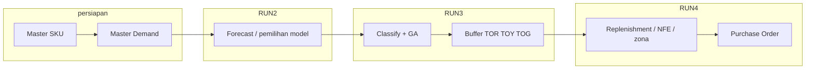
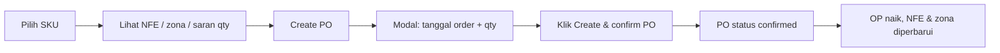

# Panduan pengguna — IDAS (DDMRP)

**IDAS** (*Inventory Decision Analytic System*) adalah aplikasi web untuk perencanaan persediaan berbasis **DDMRP hybrid** (forecast → buffer + GA → replenishment → purchase order operasional).

**Aplikasi (produksi):** [https://transtrack-ddmrp.skom.my.id](https://transtrack-ddmrp.skom.my.id)

| Lingkungan | URL |
|------------|-----|
| Produksi | https://transtrack-ddmrp.skom.my.id |
| Development (Docker lokal) | http://localhost:3001 |

---

## 1. Navigasi aplikasi

| Menu | Path | URL produksi |
|------|------|----------------|
| Dashboard | `/` | https://transtrack-ddmrp.skom.my.id/ |
| Master Data | `/master` | https://transtrack-ddmrp.skom.my.id/master |
| Master Demand | `/master/demand` | https://transtrack-ddmrp.skom.my.id/master/demand |
| Analytics & Buffer | `/analytics` | https://transtrack-ddmrp.skom.my.id/analytics |
| Replenishment | `/replenishment` | https://transtrack-ddmrp.skom.my.id/replenishment |

Semua kuantitas perencanaan dalam **PCS / EA** (satu unit per SKU dari master).

---

## 2. Alur pipeline (RUN 2 → 3 → 4)

Pipeline IDAS mengikuti notebook acuan `DDMRP_Hybrid_Algorithm_Last_Version.ipynb`. Setiap **RUN** punya peran berbeda; RUN 2–3 dijalankan dari **Analytics & Buffer**, RUN 4 dari **Replenishment**.

### Gambaran keseluruhan



| RUN | Halaman UI | Apa yang terjadi | Output utama |
|-----|------------|------------------|--------------|
| **—** | Master Data, Master Demand | Data induk & riwayat penjualan | SKU, lead time, MOQ, demand harian |
| **2** | Analytics — Forecast | Pemilihan model deret waktu terbaik | Model, metrik (MAE/RMSE/MAPE), ADU, deret forecast |
| **3** | Analytics — Classify & GA | Klasifikasi ADI–CV², optimasi VF/LTF, simulasi buffer | TOR, TOY, TOG, KPI biaya & fill rate |
| **4** | Replenishment | Rekomendasi order per hari dalam jendela lead time | `order_qty`, NFE, zona (RED/YELLOW/GREEN) per tanggal |

### RUN 2 — Forecast

- Membaca demand historis SKU dari database.
- Membandingkan beberapa model (ensemble, regresi, dll.) dan memilih yang terbaik.
- Menghasilkan **ADU** (average daily usage) dan forecast untuk horizon perencanaan.
- Di UI: tombol **Forecast only**, atau otomatis sebagai langkah pertama **Run full pipeline**.

### RUN 3 — Classify & GA (buffer)

- Mengklasifikasi pola demand (ADI–CV²).
- Menjalankan **genetic algorithm (GA)** untuk mencari kombinasi **VF** (variability factor) dan **LTF** (lead time factor) optimal.
- Mensimulasikan buffer DDMRP dan menghitung **TOR** (top of red), **TOY** (top of yellow), **TOG** (top of green).
- Hasil disimpan sebagai buffer **Active** (`ddmrp_buffer` + detail per hari).
- **On Hand operasional** diinisialisasi = **TOY** (posisi awal setelah buffer dibuat).
- Di UI: **Optimize (GA)** (butuh forecast sebelumnya) atau bagian dari **Run full pipeline**.

> **Catatan:** Dalam simulasi GA (RUN 3), **open order** sudah dimodelkan di dalam mesin simulasi. Itu berbeda dari **PO operasional** di RUN 4 (lihat bagian Purchase order).

### RUN 4 — Replenishment

- Membaca buffer **Active** terakhir untuk SKU.
- Menampilkan jendela order dari `start_date` sampai `start_date + lead_time − 1` hari.
- Setiap baris: tanggal, **order_qty** (saran), **NFE**, **zona**.
- Menambahkan blok **operasional** (hari pertama jendela): OH, OP, QD, NFE, zona, **suggested_order_qty**, daftar PO confirmed.

### Kapan menjalankan ulang pipeline?

| Situasi | Tindakan |
|---------|----------|
| SKU baru / demand baru diunggah | **Run full pipeline** untuk SKU tersebut |
| Hanya ingin memperbarui posisi harian (OH/PO/QD) | **Recalc & refresh** di Replenishment (tanpa GA) |
| Parameter GA / service level berubah | **Run full pipeline** lagi — perhatikan dampak PO ([§5](#po-dan-run-ulang-buffer)) |
| Scheduler harian (01:00) | Backend menjalankan forecast + optimize untuk semua SKU aktif — sama dampaknya pada PO |

### Scheduler harian (otomatis)

Backend dapat menjalankan **RUN 2 + 3** untuk semua SKU aktif setiap hari (default **01:00** WIB). Status terlihat di widget **Status sistem** di Dashboard. Ini **tidak** membuat PO; PO tetap manual dari Replenishment.

---

## 3. Alur kerja standar

```
Master SKU  →  Master Demand  →  Analytics RUN 2–3  →  Replenishment RUN 4  →  Purchase Order
```

### Langkah 1 — Master SKU

1. Buka **Master Data**.
2. Unduh template: tombol unduh template / `GET /api/master/template/master-sku`.
3. Isi Excel (kolom wajib: Material Number, Material Group, Lead Time_Days, harga, MOQ, dll.).
4. Unggah file → sistem **insert** SKU baru atau **update** jika kode sama.
5. Gunakan filter (grup, lead time, status) dan pencarian untuk menemukan SKU.

**Tips:** Status **Active** diperlukan agar SKU ikut pipeline analytics.

### Langkah 2 — Master Demand

1. Buka **Master Demand**.
2. Unggah file demand (format `Date`, `ID Item` / `SKU`, `Demand`).
3. Setelah unggah, cek di **Analytics** bahwa dataset status menunjukkan data siap.

### Langkah 3 — Analytics & Buffer (RUN 2 + 3)

Lihat [§2 Alur pipeline](#2-alur-pipeline-run-2--3--4) untuk detail tiap RUN.

1. Buka **Analytics & Buffer**.
2. Pilih SKU dari daftar.
3. Jalankan salah satu:
   - **Forecast only** — pemilihan model deret waktu.
   - **Optimize (GA)** — setelah forecast, optimasi VF/LTF dan TOR/TOY/TOG.
   - **Run full pipeline** — forecast + optimize sekaligus (disarankan pertama kali).

Parameter GA (service level, populasi, generasi) bisa disesuaikan di UI sebelum run.

**Hasil:**

- Model forecast terbaik, ADU, metrik.
- Klasifikasi ADI–CV², buffer optimal, KPI simulasi.
- Buffer **Active** tersimpan di database; state operasional diinisialisasi (on-hand awal = TOY).

### Langkah 4 — Replenishment (RUN 4)

1. Buka **Replenishment**.
2. Pilih SKU (hanya yang punya buffer aktif).
3. Lihat:
   - **TOR / TOY / TOG** — batas zona buffer.
   - **Posisi operasional** — On Hand, Open Order, NFE, zona, saran qty.
   - **Jendela order** — rekomendasi per hari dalam horizon lead time.

4. **Recalc & refresh** — perbarui NFE dari demand/forecast/PO terkini tanpa menjalankan ulang GA.
5. **Create PO** — modal tanggal + qty, lalu **Create & confirm PO** (langsung status confirmed).
6. **Export CSV** — unduh saran order dan PO confirmed.
7. **Riwayat PO** — daftar PO SKU (baca saja; tanpa terima/batalkan di UI).

---

## 4. Dashboard (Beranda)

Menampilkan ringkasan dari buffer aktif semua SKU:

| KPI | Arti |
|-----|------|
| Total SKU | Jumlah SKU dengan buffer aktif |
| Red zone | SKU dengan NFE di zona merah hari ini |
| Needs replenishment | SKU dengan saran order > 0 |
| Confirmed PO | SKU dengan PO confirmed yang belum diterima |

**Tabel prioritas kritis** — hingga 5 SKU zona merah, diurutkan defisit NFE.

**Status sistem** — scheduler refresh harian (default 01:00), job nightly terakhir. Refresh malam menjalankan **RUN 2 + 3** untuk semua SKU aktif — lihat [§5 PO dan run ulang buffer](#po-dan-run-ulang-buffer) jika ada PO confirmed.

---

## 5. Purchase order (loop operasional)

Setelah **RUN 3** menghasilkan buffer aktif, tim operasional dapat mengonfirmasi rekomendasi sebagai **Purchase Order (PO)**. PO adalah langkah **setelah RUN 4** — mengubah perhitungan harian **tanpa** menjalankan ulang GA.

### Dua lapisan “open order”

| Lapisan | Kapan dipakai | Keterangan |
|---------|---------------|------------|
| **Simulasi (RUN 3)** | Saat optimasi GA | Open order di dalam mesin simulasi buffer |
| **Operasional (RUN 4+)** | Setelah buffer aktif | PO confirmed di aplikasi; mempengaruhi NFE harian |

Panduan ini fokus pada **PO operasional**.

### Rumus posisi buffer (operasional)

```
NFE = On Hand (OH) + Open Order (OP) − Qualified Demand (QD)
```

| Komponen | Arti di UI / Replenishment |
|----------|---------------------------|
| **OH** | Stok fisik operasional (`on_hand`) |
| **OP** | Total qty PO **confirmed** yang masih dihitung terbuka (`open_order`) — di UI tidak ada langkah “terima barang”; PO confirmed tetap masuk OP sampai dihapus/diganti di luar aplikasi atau lewat API teknis |
| **QD** | Demand hari ini + forecast horizon (jika di atas ADU) |
| **NFE** | Net flow equation — dibandingkan ke TOR/TOY/TOG untuk zona |
| **TOR / TOY / TOG** | Batas zona; tetap dari RUN 3 sampai pipeline dijalankan ulang |

**Zona buffer:**

| Zona | Kondisi (sederhana) |
|------|---------------------|
| **RED** | NFE di bawah TOR — perlu perhatian segera |
| **YELLOW** | NFE antara TOR dan TOY |
| **GREEN** | NFE di atas TOY |

### Alur PO di aplikasi (Replenishment)

Di **UI IDAS** hanya ada satu langkah operasional: **membuat dan mengonfirmasi PO sekaligus**. Tidak ada menu **Draft**, **Terima barang (Receive)**, atau **Batalkan (Cancel)** di layar.



| Langkah | Di layar |
|---------|----------|
| 1 | Pilih SKU yang punya buffer aktif |
| 2 | Periksa **Posisi operasional** (On Hand, Open Order, NFE, zona, **suggested_order_qty**) |
| 3 | Buat PO lewat **Create PO** (panel kanan) atau tombol **Create PO** di kolom **Action** (baris **RED** / **YELLOW** di tabel jadwal) |
| 4 | Di modal: pilih **tanggal order**, sesuaikan **qty** (dibulatkan ke **MOQ** dari master) |
| 5 | Klik **Create & confirm PO** — PO langsung tercatat **confirmed** (bukan dua langkah terpisah di UI) |
| 6 | Setelah sukses: **Open order** naik, **NFE** dan zona diperbarui, notifikasi hijau menampilkan nomor PO |
| 7 | **Recalc & refresh** — perbarui NFE tanpa PO baru jika demand/forecast berubah |
| 8 | **Show PO history** — lihat daftar PO SKU (nomor, status, qty, tanggal); **hanya baca**, tanpa tombol terima/batalkan |

Opsi **Force create** (checkbox di modal, jika tidak ada saran order): melewati aturan “satu PO confirmed per SKU per hari order” — untuk uji saja.

### Status PO yang terlihat user

| Status di riwayat | Arti untuk operasi harian |
|-------------------|---------------------------|
| **confirmed** | PO yang Anda buat dari Replenishment — **memengaruhi Open order** dan NFE |
| Status lain (`draft`, `received`, `cancelled`) | Bisa muncul jika data dibuat lewat **API/backend**; **tidak dikelola dari UI** saat ini |

> **Catatan teknis:** Backend menyimpan status tambahan untuk integrasi. Panduan ini mengacu **hanya perilaku UI** yang tersedia untuk pengguna.

### Setelah PO confirmed (apa yang bisa dilakukan di UI)

| Aksi di UI | Dampak |
|------------|--------|
| **Recalc & refresh** | Hitung ulang NFE/zona dari OH, OP, QD terkini; PO confirmed tetap ada |
| **Run full pipeline** (Analytics) | Buffer & TOR/TOY/TOG baru; lihat [PO dan run ulang buffer](#po-dan-run-ulang-buffer) |
| **Buat PO lagi** (hari order lain / force) | PO confirmed tambahan sesuai aturan bisnis |

Tidak tersedia di UI: ubah PO menjadi “sudah diterima”, batalkan PO, atau mengedit qty PO setelah confirm.

### PO dan run ulang buffer

**Run ulang buffer** = menjalankan lagi **Run full pipeline** di Analytics, scheduler harian (01:00), atau API integrasi `POST /api/analytics/integration/run`. Ini **bukan** tombol **Recalc & refresh**.

#### Apa yang berubah vs tetap

| Aspek | Setelah run ulang buffer |
|--------|---------------------------|
| **Record PO di database** | **Tetap ada** — tidak otomatis dibatalkan |
| **Buffer lama** | Status **Archived**; buffer **Active** baru (ID baru) |
| **TOR / TOY / TOG** | **Berubah** (hasil GA terbaru) |
| **On Hand (OH)** | **Di-reset ke TOY buffer baru** — tidak ada langkah “terima barang” di UI untuk mempertahankan OH lama |
| **Open order (OP)** | Qty PO **confirmed** **tetap dijumlah** dalam NFE (UI tidak menutup PO setelah barang datang) |
| **Jadwal order per hari** | Baris tabel = hasil **simulasi GA baru**, bukan salinan PO lama |

#### Hal yang sering membingungkan di UI

1. **Daftar PO confirmed** di Replenishment (`confirmed_pos`) hanya menampilkan PO yang terikat **buffer aktif saat ini**. PO dibuat **sebelum** run ulang masih ada di database, tetapi bisa **tidak muncul** di daftar karena `buffer_id`-nya mengacu buffer yang sudah di-archive — sementara angka **Open order** tetap bisa > 0.

2. **Dashboard — Confirmed PO** menghitung PO yang `order_date`-nya jatuh dalam jendela tanggal buffer **baru**. Jika tanggal PO di luar jendela simulasi baru, KPI bisa tidak menghitung PO yang masih berstatus confirmed.

3. **Run ulang ≠ Recalc** — Gunakan **Recalc & refresh** bila hanya ingin memperbarui NFE dari OH/OP/QD tanpa mengganti TOR/TOY/TOG dan tanpa reset OH.

#### Rekomendasi operasional

```text
Run buffer ulang  →  PO tetap di DB; OP masih mempengaruhi NFE
                  →  OH di-reset; TOR/TOY/TOG baru; daftar PO di UI bisa tidak selaras

Recalc saja         →  Buffer & PO sama; hanya NFE/zona diperbarui
```

- Sebelum run ulang: pastikan PO **confirmed** sudah sesuai rencana (UI tidak bisa membatalkan PO lama).
- Setelah run ulang: cek **Open order** dan **NFE**; gunakan **Recalc & refresh** jika stok fisik berbeda dari TOY baru; koordinasi penutupan PO lama di luar UI jika perlu.
- Hindari run ulang semua SKU (scheduler malam) pada saat banyak PO confirmed aktif, kecuali itu memang kebijakan refresh parameter buffer.

### Aturan bisnis

- SKU harus punya buffer **Active** (sudah RUN 3).
- Qty order dibulatkan ke kelipatan **MOQ** (dan `pack_size` master, biasanya 1).
- **Tanggal terima perkiraan** = tanggal order + **lead time** (hari dari master SKU).
- Maksimal **satu PO confirmed per SKU per hari order** — jika duplikat, sistem menolak (kecuali force).
- Dashboard **Confirmed PO** = jumlah SKU yang punya PO **confirmed** (open order operasional).

### Yang ditampilkan di Replenishment

| Field UI | Sumber |
|----------|--------|
| TOR / TOY / TOG | Buffer aktif (RUN 3) |
| On Hand, Open Order, NFE, Zona | Hitungan operasional hari ini |
| Saran order (besar) | `suggested_order_qty` |
| Tabel per tanggal — `order_qty` | Saran **residual** per hari di jendela buffer |
| Riwayat PO | Daftar baca-only: id, status, qty, tanggal order |

> `order_qty` per baris tanggal **bukan** qty PO yang sudah dikonfirmasi; itu sisa rekomendasi simulasi buffer setelah recalc.

### API PO (di luar UI, untuk IT)

Endpoint `/api/purchase-orders` mendukung langkah tambahan (draft, receive, cancel) untuk integrasi ERP. **Tidak tercermin di layar Replenishment.** Rujukan: [README.md](../README.md#purchase-orders--operational-nfe-loop-operasional).

---

## 6. Scheduler harian

Backend dapat menjalankan **RUN 2 + 3** untuk semua SKU aktif setiap hari (default **01:00** WIB).

- Status: widget **Status sistem** di dashboard atau `GET /api/analytics/nightly-status`.
- Trigger manual (admin/uji): `POST /api/analytics/nightly-run-now`.

Scheduler **tidak** membuat PO otomatis, tetapi **run ulang buffer** semua SKU dapat memengaruhi PO yang sudah ada — baca [PO dan run ulang buffer](#po-dan-run-ulang-buffer).

---

## 7. Kesalahan umum

| Pesan / gejala | Penyebab | Tindakan |
|----------------|----------|----------|
| Dataset belum siap | Belum ada master / demand | Unggah Master SKU + Demand |
| No active buffer | Belum run analytics | **Run full pipeline** untuk SKU |
| 409 PO duplikat | Sudah ada PO confirmed untuk SKU pada tanggal order yang sama | Gunakan tanggal order lain, atau centang **Force create** (uji); UI tidak bisa membatalkan PO lama |
| Open order > 0 tapi daftar PO kosong | Buffer di-run ulang setelah PO dibuat | Lihat [PO dan run ulang buffer](#po-dan-run-ulang-buffer) |
| OH “melompat” setelah run malam | Scheduler reset OH ke TOY baru | **Recalc** atau sesuaikan stok; hindari run ulang jika OH sudah diverifikasi |
| UI tidak memuat data | API URL salah | Produksi: buka https://transtrack-ddmrp.skom.my.id; dev: `docker-compose.dev.yml` + http://localhost:3001 |

---

## 8. Dokumen terkait

| Dokumen | Isi |
|---------|-----|
| [INSTALLATION.md](./INSTALLATION.md) | Docker, reset database, impor data |
| [INTEGRATION_API_MANUAL.md](./INTEGRATION_API_MANUAL.md) | API untuk sistem eksternal (`sku_no`) |
| [../README.md](../README.md) | Referensi teknis API lengkap |
