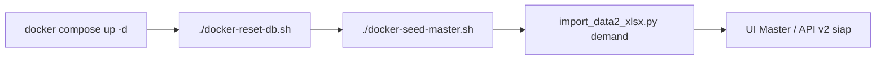
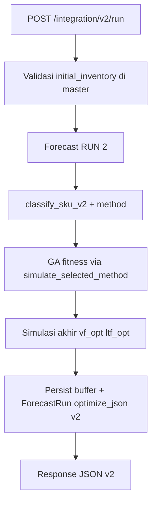

# Implementation Plan — Integration Buffer v2 (Klasifikasi → Metode Simulasi)

**Acuan notebook:** `resources_ext/Hybrid_DDMRP_with_Optimasi_Buffer_Via_GA.ipynb`  
**Dataset master baru:** `resources_ext/Data 2 June.csv` (21 kolom, termasuk Initial Inventory / Qmax / Target Percentile)  
**Scope:** Endpoint integrasi **baru** — endpoint lama tidak diubah  
**Status:** v0.8 — Fase 0–4 selesai; **Fase 5** (opsional) UI / scheduler v2

---

## 1. Tujuan

Menyediakan **API integrasi baru** yang selaras notebook terbaru:

1. **Klasifikasi ADI–CV²** menentukan **metode simulasi** (`DDMRP` vs `DDMRP_CONDITIONAL`).
2. **Genetic Algorithm (GA)** mengoptimasi **VF + LTF** dengan fitness **method-aware** (`simulate_selected_method`).
3. **Qualified demand** simulasi memakai **actual demand** (bukan forecast horizon).
4. **Initial inventory** diambil dari master (`Data 2 June.csv`).
5. **Response JSON** baru — tanpa field legacy `fv_opt`; hanya `vf_opt` (selaras notebook).

**Non-tujuan fase ini:** mengubah `POST /api/analytics/integration/run` (v1), `POST /api/analytics/run` UI, atau scheduler nightly.

---

## 2. Keputusan review (dikunci)

| # | Pertanyaan | Keputusan |
|---|------------|-----------|
| **Q1** | Fitness GA | **Method-aware** — `fitness_buffer_ga` memanggil `simulate_selected_method(cls)` untuk setiap kandidat VF/LTF |
| **Q2** | Initial inventory | **Wajib dari dataset baru** — kolom `Initial Inventory` di master; HTTP 400 jika kosong saat v2 run |
| **Q3** | Qualified demand | **Actual demand** — `qd_source="actual_demand"` seperti notebook (`demands` historis) |
| **Q4** | Scope rollout | **Endpoint baru** — tidak memodifikasi `/integration/run` v1 |
| **Q5** | Field `fv_opt` | **Dihapus di v2** — notebook memakai `vf_opt` saja; v1 tetap `fv_opt` untuk kompatibilitas ERP lama |

---

## 3. Ringkasan analisis notebook vs backend saat ini

### 3.1 Alur RUN

| Tahap | Notebook baru | Backend v1 |
|-------|---------------|------------|
| RUN 2 Forecast | Model ranking + `series_clean` | `hybrid_forecast.run_forecast` ✅ |
| RUN 3 Klasifikasi | ADI/CV² → kategori + **`method`** | `classify_sku` tanpa `method` |
| RUN 3 GA | Bounds global VF/LTF (0.01–3.0) | Bounds per kategori |
| RUN 3 Fitness | Notebook asli: selalu `simulate_ddmrp` | — |
| RUN 3 Fitness **v2** | **Method-aware** (`simulate_selected_method`) | — |
| RUN 3 Simulasi akhir | `simulate_selected_method` | Selalu `simulate_ddmrp` lama |
| Inisialisasi OH | `initial_inventory` dari master | OH = TOY |
| QD | `actual_demand` | Forecast horizon |
| MOQ / Qmax | `apply_moq_qmax` | MOQ ada; qmax tidak |
| Buffer zones | `yellow`, `green`, `tog = toy + green` | `tog = toy + max(bzr, pack_size)` |

### 3.2 Aturan routing metode

```
ADI ≤ 1.32  AND CV² ≤ 0.49  →  SMOOTH       →  DDMRP
ADI ≤ 1.32  AND CV² > 0.49  →  ERRATIC      →  DDMRP
ADI > 1.32  AND CV² ≤ 0.49  →  INTERMITTENT →  DDMRP_CONDITIONAL
ADI > 1.32  AND CV² > 0.49  →  LUMPY        →  DDMRP_CONDITIONAL
```

### 3.3 DDMRP_CONDITIONAL (port dari notebook)

- `compute_ltd_stats` — rolling lead-time demand
- `build_target_level` — dari `target_percentile` master
- `simulate_ddmrp_conditional` — trigger order berbasis target level + VF/LTF

---

## 4. Dataset master baru — `Data 2 June.csv`

### 4.1 Kolom tambahan (vs template 18 kolom lama)

| Kolom CSV | DB `sku_master` | Tipe | Contoh | Parsing |
|-----------|-----------------|------|--------|---------|
| `Initial Inventory` | `initial_inventory` | `REAL` NOT NULL (v2) | `4`, `172` | Integer/float ≥ 0 |
| `Qmax` | `qmax` | `INTEGER` nullable | `1`, `None` | `"None"` / kosong → `NULL`; else int ≥ 1 |
| `Target Percentile` | `target_percentile` | `REAL` | `98%`, `95%` | `"98%"` → `0.98`; default `0.95` jika kosong |

### 4.2 Header lengkap (21 kolom — urutan Excel/CSV)

```
Material Number;Material Description;Material Group;Unit;Criticality;ABC Class;XYZ Class;
Vendor Type;Currency;Lead Time_Days;MOQ;Sales Price;Purchase Price;
Holding Cost Rate/day;Holding Cost/day (IDR);Lost Sale Rate/Each;Penalty/unit (IDR);
Logistic Cost/Order;Initial Inventory;Qmax;Target Percentile
```

**Catatan format file:** CSV memakai delimiter `;` dan nilai Purchase Price berformat `$47,549,019.00` — parser upload harus menormalisasi (sudah ada pola serupa di import Excel).

### 4.3 Perubahan database & Master Item menu

| Layer | Perubahan |
|-------|-----------|
| `models.SKUMaster` | Tambah `initial_inventory`, `qmax`, `target_percentile` |
| `schema_migrate.py` | `ALTER TABLE` additive untuk 3 kolom |
| `master_upload_parse.py` | `MASTER_SKU_EXCEL_COLUMNS` 18 → **21**; parse 3 kolom baru |
| `api/master.py` | `SKUMasterIn` + create/update/list/export |
| `services/data_loader.get_sku_params` | Expose `initial_inventory`, `qmax`, `target_percentile` |
| `scripts/seed_data2_june.py` | **Baru** — CLI seeder master dari CSV (upsert / fresh) |
| `docker-seed-master.sh` | **Baru** — wrapper Docker (pola `docker-reset-db.sh`) |
| `scripts/import_data2_xlsx.py` | Tetap untuk workbook penuh (`sku_master` + `sales`); default opsional ke `Data 2 June.xlsx` |
| `frontend/masterSkuFields.ts` | 3 field form + kolom tabel Master Item |
| `frontend/app/master/page.tsx` | Tampilkan/edit Initial Inventory, Qmax, Target Percentile |
| `tests/test_master_sku_columns.py` | Update 18 → 21 kolom |
| `tests/test_seed_data2_june.py` | **Baru** — parser CSV + upsert logic |
| `docs/INSTALLATION.md` | Alur Docker: reset → seed master June |

**Urutan eksekusi:** Fase master data **sebelum** Fase buffer v2 — tanpa `initial_inventory` v2 run akan gagal validasi.

### 4.4 CLI seeder — `Data 2 June.csv` (Docker-first)

Stack Docker mem-mount `./resources_ext` ke **`/app/resources_ext`** di container `backend` (`docker-compose.yml`). Seeder **wajib** dijalankan di dalam container agar `DATABASE_URL` mengarah ke Postgres (`db` service), bukan SQLite lokal di host.

#### Script baru: `backend/scripts/seed_data2_june.py`

CLI khusus **master SKU** dari `Data 2 June.csv` (21 kolom). Demand **tidak** disentuh — tetap dari `Data 2.xlsx` / `Data 2 June.xlsx` sheet `sales` via `import_data2_xlsx.py` bila diperlukan.

```text
Usage (di dalam container backend):
  python scripts/seed_data2_june.py [options]

Options:
  --csv PATH       Path ke CSV (default: /app/resources_ext/Data 2 June.csv)
  --update         Upsert: insert SKU baru, update baris yang sudah ada (default)
  --fresh-master   Hapus semua baris sku_master lalu import penuh dari CSV
  --dry-run        Validasi & parse saja, tanpa commit DB
  -q, --quiet      Ringkas output
```

**Perilaku:**

| Mode | Aksi |
|------|------|
| `--update` (default) | `INSERT` SKU baru; `UPDATE` kolom master (termasuk `initial_inventory`, `qmax`, `target_percentile`) untuk SKU yang sudah ada |
| `--fresh-master` | `DELETE FROM sku_master` (atau TRUNCATE hanya master jika tidak ada FK blocking) lalu import semua baris CSV |
| `--dry-run` | Parse CSV + laporkan inserted/updated/skipped tanpa `commit` |

**Alur internal (sama dengan API upload):**

1. `migrate_sku_master_columns(engine)` — pastikan 3 kolom baru ada
2. `pd.read_csv(path, sep=";", encoding="utf-8")` + normalisasi header
3. `_coerce_master_sku_upload(df)` — parser bersama dengan Master Data API
4. Upsert ke `sku_master` (termasuk field baru)

**Catatan:** `--fresh-master` tidak menghapus `daily_record` / buffer — gunakan `./docker-reset-db.sh` dulu jika ingin lingkungan benar-benar kosong.

#### Wrapper host: `docker-seed-master.sh`

Pola sama dengan `docker-reset-db.sh`:

```bash
#!/usr/bin/env bash
# Seed / update sku_master dari resources_ext/Data 2 June.csv (stack Docker harus running).
set -euo pipefail
cd "$(dirname "$0")"

ARGS=("$@")
if [ ${#ARGS[@]} -eq 0 ]; then
  ARGS=(--update)
fi

echo "Seeding master SKU (Data 2 June.csv) di container backend …"
docker compose exec -T backend python scripts/seed_data2_june.py "${ARGS[@]}"
echo "Selesai."
```

#### Perintah Docker (dari root repo)

**Prasyarat:** stack sudah jalan.

```bash
# Dev (frontend → localhost:8000)
docker compose -f docker-compose.yml -f docker-compose.dev.yml up -d --build

# 1) Kosongkan DB (opsional, lingkungan uji bersih)
./docker-reset-db.sh

# 2) Seed / update master dari CSV (default: upsert)
./docker-seed-master.sh

# 3) Import demand dari workbook (jika daily_record masih kosong)
docker compose exec -T backend python scripts/import_data2_xlsx.py \
  --xlsx /app/resources_ext/Data\ 2\ June.xlsx

# Alternatif tanpa wrapper — upsert eksplisit
docker compose exec -T backend python scripts/seed_data2_june.py \
  --csv "/app/resources_ext/Data 2 June.csv" --update

# Dry-run validasi parser
docker compose exec -T backend python scripts/seed_data2_june.py --dry-run

# Ganti seluruh master dari CSV (hati-hati: SKU hilang jika tidak ada di file)
docker compose exec -T backend python scripts/seed_data2_june.py --fresh-master
```

**Path di container vs host:**

| Host | Container (`backend`) |
|------|------------------------|
| `./resources_ext/Data 2 June.csv` | `/app/resources_ext/Data 2 June.csv` |
| `./resources_ext/Data 2 June.xlsx` | `/app/resources_ext/Data 2 June.xlsx` |

**Jangan** menjalankan `python scripts/seed_data2_june.py` dari host `cd backend` kecuali `DATABASE_URL` sengaja di-set ke Postgres — default lokal adalah SQLite (`sql_app.db`) dan data tidak masuk ke DB Docker.

#### Alur setup lengkap (Docker, lingkungan baru)



1. `docker compose … up -d --build`
2. `./docker-reset-db.sh` — TRUNCATE semua tabel operasional (Postgres)
3. `./docker-seed-master.sh` — 45 SKU + `initial_inventory` / `qmax` / `target_percentile`
4. `import_data2_xlsx.py --xlsx /app/resources_ext/Data 2 June.xlsx` — sheet `sales` (jika workbook tersedia)
5. Verifikasi: `GET http://localhost:8000/api/master/skus` atau Master Item di UI

---

## 5. Arsitektur — endpoint baru (v1 tidak disentuh)

### 5.1 Endpoint baru

| Method | Path | Keterangan |
|--------|------|------------|
| `POST` | `/api/analytics/integration/v2/run` | Forecast + klasifikasi + GA method-aware + persist buffer |
| `GET` | `/api/analytics/integration/v2/result` | Ambil hasil run terakhir per SKU (JSON v2) |
| `GET` | `/api/analytics/integration/v2/replenishment` | Replenishment dari buffer v2 terakhir |

**Endpoint lama tetap:**

| Method | Path | Perilaku |
|--------|------|----------|
| `POST` | `/api/analytics/integration/run` | **Tidak berubah** (engine v1, `fv_opt`) |
| `GET` | `/api/analytics/integration/result` | Tidak berubah |
| `GET` | `/api/analytics/integration/replenishment` | Tidak berubah |

### 5.2 Flow v2



### 5.3 Modul baru

| File | Isi |
|------|-----|
| `services/buffer_v2/classification.py` | `classify_sku_v2` (+ `method`) |
| `services/buffer_v2/simulate_ddmrp.py` | `simulate_ddmrp` notebook (`actual_demand`, `initial_inventory`, `qmax`) |
| `services/buffer_v2/simulate_conditional.py` | LTD stats, `build_target_level`, `simulate_ddmrp_conditional` |
| `services/buffer_v2/ga_optimizer.py` | GA + **`fitness_buffer_ga_method_aware`** |
| `services/buffer_v2/pipeline.py` | `run_buffer_optimization_v2` |
| `services/buffer_v2/response.py` | `build_simulation_summary`, `build_v2_notebook_json`, `daily_simulation_csv_response` |
| `services/buffer_v2/common.py` | `export_daily_simulation` (records + CSV string) |
| `api/analytics.py` | Router v2 terpisah; query `csv`; **tidak** mengubah handler v1 |

### 5.4 Fitness GA method-aware (deviasi dari notebook)

Notebook asli memakai `simulate_ddmrp` di fitness. Implementasi v2:

```python
def fitness_buffer_ga_method_aware(vf, ltf, demands, dates, params, cls):
    buffer = build_buffer(demands, vf, ltf, params)
    kpi = simulate_selected_method(
        demands=demands,
        dates=dates,
        vf=vf,
        ltf=ltf,
        params=params,
        clf=cls,
        qd_source="actual_demand",
    )
    # + service-level penalty (sama konsep notebook)
    return fitness, kpi, buffer
```

Konsistensi: VF/LTF optimal untuk INTERMITTENT/LUMPY dievaluasi langsung pada `DDMRP_CONDITIONAL`.

---

## 6. Kontrak API — `/api/analytics/integration/v2/*`

### 6.1 Request body — `POST …/v2/run`

```json
{
  "sku_no": "100008503",
  "sl_target": 0.95,
  "pop_size": 30,
  "n_gen": 80,
  "include_baseline": true
}
```

`sl_target` = target service level GA (penalti). `target_percentile` simulasi conditional diambil dari **master** (`target_percentile`), bukan dari body.

**Query parameter opsional (run & result):**

| Param | Default | Perilaku |
|-------|---------|----------|
| `csv` | `false` | Jika `true` (`?csv` atau `?csv=true`): respons **file CSV** simulasi harian (`Content-Type: text/csv`), bukan JSON |

**Catatan zsh:** URL dengan `?` harus di-quote: `curl "http://localhost:8000/.../result?sku_no=100008503"`.

### 6.2 Response JSON default (`csv=false`)

Ringkasan KPI mengikuti **stdout notebook** (`SIMULASI DDMRP` / `SIMULASI DDMRP_CONDITIONAL`) + tabel harian `daily_simulation` (setara `df_detail` / `df_daily_opt` di notebook).

```json
{
  "sku_no": "100008503",
  "status": "ok",
  "api_version": "v2",
  "buffer_id": 12,
  "latest_run_id": 8,
  "unit": "EA",
  "simulation_summary": {
    "Method": "DDMRP_CONDITIONAL",
    "VF": "0.4750",
    "LTF": "0.3000",
    "Initial Inventory": "2.0",
    "ADU": "0.0132",
    "TOR": "0.09",
    "TOY": "0.71",
    "TOG": "1.71",
    "Target Percentile": "0.98",
    "Target Level": "2.00",
    "Safety Stock": null,
    "Fill Rate": "100.00%",
    "CSL": "100.00%",
    "Stockout Days": 0,
    "Jumlah Order": 3,
    "Total Qty Order": 3,
    "Total Cost": "Rp3,682,598"
  },
  "simulation_summary_text": "Method : DDMRP_CONDITIONAL\nVF     : 0.4750\nLTF    : 0.3000\n…",
  "daily_simulation": [
    {
      "date": "2024-01-02",
      "method": "DDMRP_CONDITIONAL",
      "demand": 0.0,
      "receipt": 0.0,
      "oh_end": 2.0,
      "open_order": 0.0,
      "qualified_demand": 0.0,
      "nfe": 2.0,
      "zone": "GREEN",
      "order_qty": 0,
      "shipped": 0.0,
      "unmet": 0.0,
      "holding_cost": 0.0,
      "order_cost": 0.0,
      "penalty_cost": 0.0,
      "total_cost": 0.0,
      "TOR": 0.09,
      "TOY": 0.71,
      "TOG": 1.71,
      "target_level": 2.0,
      "order_reason": "NO_ORDER"
    }
  ]
}
```

- `simulation_summary` — label & format nilai sama seperti print notebook (`100.00%`, `Rp3,682,598`).
- `simulation_summary_text` — teks multiline siap log / tampilan cepat (`jq -r '.simulation_summary_text'`).
- `daily_simulation` — satu baris per hari; kolom conditional menambah `target_level`.
- Respons API **tidak** mengekspos `predictions` forecast, `daily_simulation_csv`, atau blob `optimize`/`forecast` nested (data internal tetap di `forecast_run.optimize_json`).

### 6.3 Response CSV (`csv=true`)

`POST /integration/v2/run?csv=true` atau `GET /integration/v2/result?sku_no=…&csv=true`:

- Body: teks CSV (header + baris harian).
- Header: `Content-Disposition: attachment; filename="daily_simulation_<sku>.csv"`.
- Gunakan untuk salin ke Excel / analisa manual.

Kolom CSV (optimized simulation):

```text
date,method,demand,receipt,oh_end,open_order,qualified_demand,nfe,zone,order_qty,
shipped,unmet,holding_cost,order_cost,penalty_cost,total_cost,TOR,TOY,TOG,
order_reason[,target_level untuk DDMRP_CONDITIONAL]
```

### 6.4 Payload internal tersimpan (`forecast_run.optimize_json`)

DB menyimpan payload pipeline lengkap untuk audit & export CSV ulang:

- `classification`, `optimization` (`vf_opt`, `ltf_opt`), `simulation`, `buffer`, `baseline`, `optimized`
- `daily_simulation` (array) + `daily_simulation_csv` (string)
- `api_version: "v2"` — **tanpa** `fv_opt`

Forecast di `forecast_run.forecast_json` — tanpa field `predictions` (v2).

### 6.5 Perbedaan v2 vs v1 (integrasi)

| Aspek | v1 (`/integration/run`) | v2 (`/integration/v2/run`) |
|-------|-------------------------|----------------------------|
| Engine | `hybrid_pipeline` | `buffer_v2` method-aware |
| `fv_opt` / `vf_opt` | `fv_opt` (legacy) | **`vf_opt` saja** |
| `classification.method` | Tidak ada | **`DDMRP` / `DDMRP_CONDITIONAL`** |
| QD simulasi | Forecast horizon | **`actual_demand`** |
| OH awal operasional | TOY | **`initial_inventory`** master |
| Response utama | `forecast` + `optimize` nested | **`simulation_summary`** + `daily_simulation` |
| Export harian | Tidak ada | Query **`csv=true`** → file CSV |
| Forecast `predictions` | Ada | **Tidak diekspos** di v2 |

### 6.6 Persistensi DB

- `ddmrp_buffer.vf_opt` / `ltf_opt` — dari hasil GA v2 (kolom DB sudah `vf_opt`, bukan `fv_opt`).
- `tor`, `toy`, `tog` — dari KPI simulasi akhir method-aware.
- `forecast_run.optimize_json` — payload v2 penuh.
- `seed_operational_state` — `on_hand = initial_inventory` dari master.
- Versi buffer: tag `version` mis. `v2-YYYYMMDD` atau field `buffer_engine: v2` di JSON.

---

## 7. Fase implementasi

### Fase 0 — Master data `Data 2 June` + CLI seeder Docker — ✅ **SELESAI** (2026-06-29)

**Backend / DB**

- [x] Migrasi DB: `initial_inventory`, `qmax`, `target_percentile` di `sku_master` (`models.py` + `schema_migrate.py`)
- [x] Update `MASTER_SKU_EXCEL_COLUMNS` (21 kolom) + parser + template export
- [x] Update `SKUMasterIn`, API CRUD, `get_sku_params`
- [x] **`backend/scripts/seed_data2_june.py`** — CLI upsert/fresh-master/dry-run; default CSV `/app/resources_ext/Data 2 June.csv`
- [x] **`docker-seed-master.sh`** — wrapper `docker compose exec backend python scripts/seed_data2_june.py`
- [x] Unit test `test_seed_data2_june.py`: delimiter `;`, `98%`, `Qmax=None`, 45 baris CSV
- [x] Unit test `test_master_sku_columns.py`: 21 kolom

**Docker / verifikasi**

- [x] Volume `./resources_ext:/app/resources_ext` di `docker-compose.yml`
- [x] Seeder Docker: **45 SKU updated** di Postgres (`postgresql://ddmrp_user@db/ddmrp_db`)
- [x] API check SKU `100008503`: `initial_inventory=2`, `qmax=1`, `target_percentile=0.98`

**Frontend**

- [x] Master Item: form 21 kolom (`initial_inventory`, `qmax`, `target_percentile`)

#### Perintah Docker — Fase 0 (referensi cepat)

```bash
# Dev stack (dari root repo)
docker compose -f docker-compose.yml -f docker-compose.dev.yml up -d --build

# Kosongkan DB operasional (opsional)
./docker-reset-db.sh

# Seed / update master dari Data 2 June.csv (default: upsert)
./docker-seed-master.sh

# Opsi seeder
./docker-seed-master.sh --dry-run
docker compose exec -T backend python scripts/seed_data2_june.py --fresh-master

# Import demand (workbook, jika daily_record kosong)
docker compose exec -T backend python scripts/import_data2_xlsx.py \
  --xlsx "/app/resources_ext/Data 2 June.xlsx"

# Verifikasi master
curl -s http://localhost:8000/api/master/skus | python3 -c \
  "import json,sys; d=json.load(sys.stdin); print('SKU count', len(d['skus']))"
```

| Path host | Path container |
|-----------|----------------|
| `./resources_ext/Data 2 June.csv` | `/app/resources_ext/Data 2 June.csv` |

**Penting:** jalankan seeder **di dalam container** (`./docker-seed-master.sh`), bukan `python scripts/seed_data2_june.py` di host tanpa `DATABASE_URL` Postgres.

### Fase 1 — Port inti notebook + method-aware GA — ✅ **SELESAI** (2026-06-29)

- [x] `classify_sku_v2` (+ `method`) → `services/buffer_v2/classification.py`
- [x] `simulate_ddmrp` v2 (`actual_demand`, `initial_inventory`, `qmax`) → `simulate_ddmrp.py`
- [x] `simulate_ddmrp_conditional` + `build_target_level` → `simulate_conditional.py`
- [x] `simulate_selected_method` orchestrator → `selected_method.py`
- [x] `fitness_buffer_ga_method_aware` + `run_ga_buffer_optimization` → `ga_optimizer.py`
- [x] `run_buffer_optimization_v2` pipeline → `pipeline.py`
- [x] Unit tests `tests/test_buffer_v2.py` — synthetic + **Data 2 June** (7 tes integrasi, 3 SKU pipeline)
- [x] `db_dataset.py` — expose `Initial Inventory`, `Qmax`, `Target Percentile` ke `get_sku_params`

#### Unit test Data 2 June (pre–Fase 2)

```bash
# Lokal / Docker
cd backend && python3 -m unittest tests.test_buffer_v2.TestBufferV2Data2June -v
docker compose exec -T backend python -m unittest tests.test_buffer_v2.TestBufferV2Data2June -v
```

SKU acuan: `100006303` (SMOOTH), `100008503` (INTERMITTENT), `100005106` (LUMPY).

### Fase 2 — Endpoint v2 + kontrak output JSON/CSV — ✅ **SELESAI** (2026-06-29)

**Endpoint & persistensi**

- [x] `POST /api/analytics/integration/v2/run`
- [x] `GET /api/analytics/integration/v2/result`
- [x] `GET /api/analytics/integration/v2/replenishment`
- [x] Validasi 400 jika `initial_inventory` null
- [x] Buffer version prefix `v2-`; OH operasional = `initial_inventory` (bukan TOY)
- [x] **Tidak mengubah** handler `/integration/run` v1

**Kontrak respons (selaras notebook)**

- [x] Query `csv` — default JSON ringkasan; `csv=true` → file CSV simulasi harian
- [x] `simulation_summary` — label notebook (`Method`, `VF`, `TOR`, `Fill Rate`, `Total Cost` Rp, dll.)
- [x] `simulation_summary_text` — multiline seperti stdout notebook
- [x] `daily_simulation` — array per hari (`df_detail` optimized)
- [x] `export_daily_simulation` + `services/buffer_v2/response.py`
- [x] Tanpa `predictions` di forecast v2; tanpa `fv_opt`; tanpa blob `optimize` nested di respons API
- [x] `tests/test_integration_v2_api.py`, `tests/test_buffer_v2_response.py`

#### Perintah curl — Fase 2 (Docker, `localhost:8000`)

```bash
# JSON ringkasan + daily_simulation (default)
curl -s -X POST http://localhost:8000/api/analytics/integration/v2/run \
  -H "Content-Type: application/json" \
  -d '{"sku_no":"100008503","pop_size":8,"n_gen":5}'

# Ringkasan teks notebook
curl -s "http://localhost:8000/api/analytics/integration/v2/result?sku_no=100008503" \
  | jq -r '.simulation_summary_text'

# CSV harian → file Excel
curl -s "http://localhost:8000/api/analytics/integration/v2/result?sku_no=100008503&csv=true" \
  -o simulasi.csv

# Run langsung ke CSV
curl -s -X POST "http://localhost:8000/api/analytics/integration/v2/run?csv=true" \
  -H "Content-Type: application/json" \
  -d '{"sku_no":"100008503","pop_size":8,"n_gen":5}' \
  -o simulasi.csv

# Replenishment dari buffer v2 aktif
curl -s "http://localhost:8000/api/analytics/integration/v2/replenishment?sku_no=100008503"
```

**Penting zsh:** quote URL yang mengandung `?`.

**Verifikasi:** `100008503` → `INTERMITTENT` / `DDMRP_CONDITIONAL`, `simulation_summary.Total Cost` terformat `Rp…`, `buffer_id` + `version` prefix `v2-`.

### Fase 3 — Dokumentasi & parity notebook — ✅ **SELESAI** (2026-06-29)

- [x] Parity 3 SKU uji: `100006303` (SMOOTH), `100008503` (INTERMITTENT), `100005106` (LUMPY)
- [x] TOR/TOY/TOG within toleransi **1%** (`tests/test_buffer_v2_parity.py`, GA `random_state=42`, pop=30, gen=80)
- [x] Parity `simulation_summary` + `daily_simulation` — SKU `100008503` cocok notebook (VF 0.475, Total Cost Rp3,682,598)
- [x] **`docs/INTEGRATION_API_MANUAL_V2.md`** — manual API v2 (baru; v1 tidak diubah)
- [x] **`docs/USER_MANUAL_V2.md`** — panduan master 21 kolom & konsep buffer v2 (baru)
- [x] **`docs/INSTALLATION.md`** — alur `docker-seed-master.sh`, verifikasi curl v2, parity test

#### Unit test parity

```bash
cd backend && python3 -m unittest tests.test_buffer_v2_parity -v
```

### Fase 4 — Verifikasi regresi v1 & SLA — ✅ **SELESAI** (2026-06-29)

- [x] Regresi v1: `tests/test_integration_v1_regression.py` — pipeline `fv_opt`, tanpa `method`/`api_version` v2
- [x] Regresi HTTP v1: `POST /integration/run`, `result`, `replenishment` — kontrak `forecast` + `optimize.fv_opt`
- [x] v2 replenishment 200 — sudah di `tests/test_integration_v2_api.py`
- [x] Durasi GA terdokumentasi di `docs/INTEGRATION_API_MANUAL_V2.md` §5 (Data 2 June, pop=30, gen=80)

#### Perintah verifikasi Fase 4

```bash
cd backend && python3 -m unittest tests.test_integration_v1_regression -v
cd backend && python3 -m unittest tests.test_integration_v2_api -v
```

#### Referensi durasi GA v2 (host referensi, 2026-06-29)

| SKU | ~detik |
|-----|--------|
| `100006303` | 21.5 |
| `100008503` | 31.9 |
| `100005106` | 26.5 |

Parameter: `pop_size=30`, `n_gen=80`. v1 pada dataset sama: ~29–39 detik/SKU.

### Fase 5 — Ekspansi (opsional, backlog)

- [ ] UI Analytics RUN 3 → v2 behind flag
- [ ] Nightly scheduler → path v2 terpisah
- [ ] Deprecate v1 (komunikasi ke konsumen ERP)

---

## 8. File yang akan disentuh

| File | Perubahan |
|------|-----------|
| `resources_ext/Data 2 June.csv` | Acuan import master baru |
| `backend/models.py` | 3 kolom `sku_master` |
| `backend/schema_migrate.py` | Migrasi kolom baru |
| `backend/services/master_upload_parse.py` | 21 kolom + parsing |
| `backend/api/master.py` | `SKUMasterIn` + persist |
| `backend/services/data_loader.py` | Params v2 |
| `backend/scripts/seed_data2_june.py` | **Baru** — CLI seeder CSV master |
| `docker-seed-master.sh` | **Baru** — wrapper Docker |
| `backend/scripts/import_data2_xlsx.py` | Demand + master workbook (tetap terpisah dari seeder CSV) |
| `docker-compose.yml` | Volume `resources_ext` (sudah ada — verifikasi saja) |
| `docs/INSTALLATION.md` | Seed June + verifikasi v2 |
| `docs/INTEGRATION_API_MANUAL_V2.md` | **Baru** — API integrasi v2 |
| `docs/USER_MANUAL_V2.md` | **Baru** — panduan buffer v2 |
| `backend/tests/test_buffer_v2_parity.py` | Parity notebook |
| `backend/tests/test_integration_v1_regression.py` | **Baru** — regresi v1 |

**Tidak disentuh (fase ini):** `hybrid_optimizer.py`, `hybrid_pipeline.py` (kecuali thin import), handler v1 di `analytics.py`.

---

## 9. Risiko & mitigasi

| Risiko | Dampak | Mitigasi |
|--------|--------|----------|
| Master lama tanpa `initial_inventory` | v2 run gagal 400 | `./docker-seed-master.sh` setelah deploy |
| Seeder dijalankan di host (SQLite) | Data tidak masuk Postgres Docker | Selalu `docker compose exec backend …` atau `./docker-seed-master.sh` |
| `--fresh-master` tanpa reset demand | SKU di demand tanpa master | Dokumentasikan urutan reset → seed → import demand |
| GA method-aware lebih lambat | Timeout integrasi | Default pop_size=30, n_gen=80; dokumentasi SLA |
| Dua set endpoint (v1/v2) | Kebingungan integrator | Dokumentasi jelas; v1 frozen |
| `Qmax=None` di CSV | Parser salah | Normalisasi eksplisit `None`/`null`/kosong → NULL |
| `Target Percentile` format `98%` | Parse error | Regex `%` + unit test |
| ERP masih baca `fv_opt` | Break jika pindah v2 tanpa update | v1 tetap ada; v2 pakai `vf_opt` |
| Respons tanpa `predictions` | Payload besar / tidak dipakai v2 | `include_predictions=False` di v2 |
| URL `?` di zsh | `no matches found` | Dokumentasikan quote URL di manual |

---

## 10. Kriteria selesai (Definition of Done)

- [x] `./docker-seed-master.sh` sukses di stack Docker; 45 SKU di Postgres dengan `initial_inventory` terisi
- [x] `seed_data2_june.py --dry-run` lulus
- [x] Master Item UI menampilkan Initial Inventory, Qmax, Target Percentile
- [x] `POST /integration/v2/run` → method benar untuk 3 SKU uji (unit test Data 2 June)
- [x] Fitness GA method-aware (unit test + pipeline INTERMITTENT)
- [x] QD = actual demand (tersimpan di `optimize_json.simulation.qd_source`)
- [x] Response v2 **tanpa** `fv_opt` / `predictions`; `vf_opt` di payload internal
- [x] `simulation_summary` + `daily_simulation` selaras format notebook
- [x] Query `csv=true` mengembalikan CSV harian untuk Excel
- [x] TOR/TOY/TOG within tolerance vs notebook ≥2 SKU (Fase 3 — 3 SKU, 1%)
- [x] `GET /integration/v2/replenishment` sukses (curl Docker)
- [x] `POST /integration/run` v1 regresi bersih (Fase 4 — `test_integration_v1_regression.py`)
- [x] Dokumentasi v2: `INTEGRATION_API_MANUAL_V2.md` + `USER_MANUAL_V2.md` (Fase 3)
- [x] `INSTALLATION.md` — seed June + verifikasi v2 (Fase 3)
- [x] ≥10 unit test baru lulus (24+ tests termasuk parity)

---

## 11. Referensi

| Dokumen / kode | Lokasi |
|----------------|--------|
| Notebook baru | `resources_ext/Hybrid_DDMRP_with_Optimasi_Buffer_Via_GA.ipynb` |
| Dataset master baru | `resources_ext/Data 2 June.csv` |
| Pipeline v1 | `backend/services/hybrid_pipeline.py` |
| Integration v1 | `backend/api/analytics.py` → `integration_run` |
| Manual integrasi v1 | `docs/INTEGRATION_API_MANUAL.md` |
| Manual integrasi v2 | `docs/INTEGRATION_API_MANUAL_V2.md` |
| Panduan pengguna v2 | `docs/USER_MANUAL_V2.md` |

---

**Versi dokumen:** 0.8 (2026-06-29) — Fase 4: regresi v1, SLA GA di manual v2. **Berikutnya: Fase 5** (opsional).
