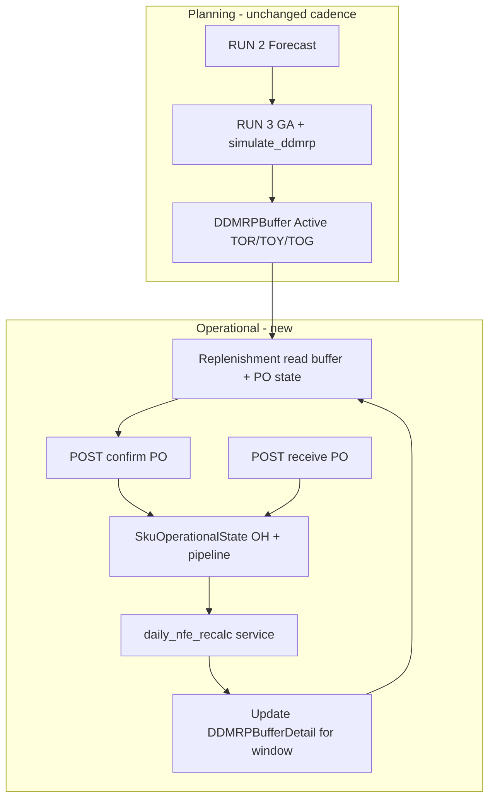

# Implementation plan — Open order (PO) + daily NFE recalc + Replenishment UI

**Date:** 2026-05-15  
**Scope:** Close the operational loop between Replenishment recommendations and buffer position **without** re-running GA on every PO.  
**References:** `DDMRP_Hybrid_Algorithm_Last_Version.ipynb` (NFE = OH + OP − QD), `hybrid_optimizer.simulate_ddmrp`, `PHASE0_AUDIT.md`, `implementation_plan.md`.

---

## 1. Goals & non-goals

### Goals

| # | Goal |
|---|------|
| G1 | Persist **purchase orders (PO)** created from Replenishment with status lifecycle (draft → confirmed → received / cancelled). |
| G2 | After PO **confirm**, recalculate **NFE, zone, and suggested order_qty** for the active buffer window using **fixed TOR/TOY/TOG** from the last pipeline run (no GA). |
| G3 | Wire **Create PO** on Replenishment to real API; refresh buffer position and summary cards from updated operational state. |
| G4 | Clarify dashboard metrics: separate **“planned orders in buffer”** vs **“confirmed POs”**. |

### Non-goals (this phase)

- ERP integration (SAP, etc.) — manual confirm/receipt in-app only.
- Re-forecast or re-optimize VF/LTF on each PO (full pipeline remains on Analytics / nightly).
- Carton conversion — single planning unit from `SKUMaster.unit` only.
- Multi-line PO across warehouses / vendors.

---

## 2. Current state (baseline)

| Layer | Today |
|-------|--------|
| **RUN 3 simulation** | `OP` = sum of `pipeline` receipts within DLT; orders add to `pipeline[arrival_date]`. |
| **RUN 4 persist** | `DDMRPBuffer` + `DDMRPBufferDetail` store `order_qty`, `nfe`, `zone` per day — snapshot from **last** simulation, not live OH/OP. |
| **Replenishment UI** | Reads `/api/analytics/replenishment`; Create PO = demo message / CSV only. |
| **Dashboard `open_order`** | Counts SKUs with any `order_qty > 0` in buffer window — **not** confirmed POs. |
| **`DailyRecord`** | Has `oh_end`, `open_order`, `nfe` columns — **not** fed by hybrid replenishment loop. |

---

## 3. Target architecture



**Principle:** TOR/TOY/TOG and `vf_opt`/`ltf_opt` change only when user runs **full pipeline** or **nightly job**. PO events only move **OH / OP (pipeline)** and derived **NFE / zone / residual order suggestion**.

---

## 4. Workstreams (implementation order)

| Phase | Workstream | Depends on |
|-------|------------|------------|
| **P1** | Data model + migration + PO API | — |
| **P2** | Operational state seed + daily NFE recalc service | P1 |
| **P3** | Replenishment UI + dashboard label fix | P1, P2 (partial OK after P1 for confirm-only) |

Recommended sequence: **P1 → P2 → P3** (P3 can start API wiring in parallel once P1 contracts are frozen).

---

## P1 — Model PO + API confirm

### 4.1 New tables (SQLAlchemy + `schema_migrate.py`)

#### `purchase_order`

| Column | Type | Notes |
|--------|------|--------|
| `id` | PK | |
| `sku` | FK → `sku_master.sku` | |
| `buffer_id` | FK → `ddmrp_buffer.id` | Buffer version PO was created against |
| `order_date` | Date | Server / user reference day (usually buffer `start_date`) |
| `qty` | Float | Planning unit |
| `unit` | String | Copy from master at create time |
| `expected_receipt_date` | Date | `order_date + lead_time` (calendar days; align with notebook DLT) |
| `status` | String | `draft` \| `confirmed` \| `received` \| `cancelled` |
| `source` | String | `replenishment` \| `manual` \| `integration` |
| `created_at` | DateTime | |
| `confirmed_at` | DateTime nullable | |
| `received_at` | DateTime nullable | |
| `notes` | Text nullable | |

Indexes: `(sku, status)`, `(buffer_id)`, `(expected_receipt_date)`.

#### `sku_operational_state` (one row per SKU, upserted)

| Column | Type | Notes |
|--------|------|--------|
| `sku` | PK | |
| `as_of_date` | Date | Last recalc date |
| `on_hand` | Float | OH start-of-day for `as_of_date` |
| `buffer_id` | FK | Active buffer used for TOR/TOY/TOG |
| `updated_at` | DateTime | |

**Initial OH seed (P2):** default `on_hand = TOY` from active buffer at first recalc or first PO — document in README as teaching default; optional later: master field `initial_on_hand`.

#### `purchase_order_pipeline` (optional normalized; alternative: derive OP from PO rows)

If keeping logic simple, **derive OP from `purchase_order`** where `status = confirmed` and `expected_receipt_date > as_of_date` without a separate pipeline table. Add pipeline table only if receipt splitting or partial receipts are required in v1 — **recommend derive-only for v1**.

### 4.2 ORM & migration

- Add models in `backend/models.py`.
- Extend `backend/schema_migrate.py` with `migrate_open_order_tables(engine)` creating new tables if missing (SQLite-safe).
- Call from `main.py` startup alongside existing SKU master migration.

### 4.3 Service layer — `backend/services/open_order_service.py`

| Function | Responsibility |
|----------|----------------|
| `create_draft_po(db, sku, qty, buffer_id?, order_date?)` | Validate active buffer; qty ≥ MOQ rounding per `pack_size`/`moq`; status `draft`. |
| `confirm_po(db, po_id)` | `draft` → `confirmed`; trigger `recalc_operational_nfe(db, sku)`. |
| `receive_po(db, po_id, receipt_qty?)` | `confirmed` → `received`; move qty to OH; trigger recalc. |
| `cancel_po(db, po_id)` | Allowed for `draft`/`confirmed` (not `received`); trigger recalc. |
| `list_pos(db, sku?, status?, buffer_id?)` | For UI history. |

**MOQ / pack_size:** use `SKUMaster.moq` and `pack_size` same as `simulate_ddmrp` (`int(max((tog - nfe), pack_size))` rounding).

### 4.4 API router — `backend/api/purchase_order.py` (prefix `/api/purchase-orders`)

| Method | Path | Body / query | Response |
|--------|------|--------------|----------|
| `POST` | `/` | `{ sku, qty, order_date?, notes? }` | PO draft |
| `POST` | `/{id}/confirm` | — | PO confirmed + recalc summary |
| `POST` | `/{id}/receive` | `{ receipt_qty? }` | PO received + recalc summary |
| `POST` | `/{id}/cancel` | — | PO cancelled |
| `GET` | `/` | `sku`, `status`, `limit`, `offset` | List |
| `GET` | `/{id}` | — | Detail |

Register router in `main.py`.

**Confirm response shape (for UI):**

```json
{
  "po": { "id": 1, "sku": "1000001", "qty": 171, "status": "confirmed", ... },
  "recalc": {
    "sku": "1000001",
    "as_of_date": "2024-05-01",
    "on_hand": 196.0,
    "open_order": 171.0,
    "nfe": 58.45,
    "zone": "YELLOW",
    "suggested_order_qty": 0,
    "tor": 58, "toy": 196, "tog": 340
  }
}
```

### 4.5 Validation rules

- SKU must have **Active** `DDMRPBuffer`.
- `qty > 0`; optional warn if `qty` ≠ replenishment `order_qty` for `order_date` (allow override with `force: true`).
- Cannot confirm same SKU + `order_date` twice if business rule is one PO per day per SKU (configurable flag).
- `expected_receipt_date = order_date + SKUMaster.lead_time` (fallback `buffer.dlt`).

### 4.6 Tests (P1)

- `backend/tests/test_purchase_order_api.py`: create → confirm → list; cancel draft; receive updates status.
- Fixture: minimal buffer + buffer_detail in SQLite test DB.

---

## P2 — Recalc NFE harian tanpa re-GA

### 5.1 New module — `backend/services/operational_nfe.py`

Extract **QD and zone logic** from `simulate_ddmrp` into reusable pure functions (no random LT in operational path — use fixed `dlt`).

#### Inputs per recalc (`sku`, `as_of_date`)

| Input | Source |
|-------|--------|
| TOR, TOY, TOG, DLT | Active `DDMRPBuffer` |
| OH | `sku_operational_state.on_hand` (+ receipts for `as_of_date` if processing day roll-forward) |
| OP | `SUM(qty)` of PO `confirmed` with `expected_receipt_date > as_of_date` and `order_date <= as_of_date` |
| QD | See below |
| Forecast series | Latest `ForecastRun.optimize_json` or re-build via `build_forecast_series_for_simulation` from stored forecast JSON |

#### QD (aligned with notebook)

For operational day `t` (index in horizon):

```
qd = demand_actual[t]  # from DailyRecord if exists else ADU
for k in 1..dlt:
  if forecast[t+k] > OST:   # OST = ADU from buffer
    qd += forecast[t+k]
```

Use `get_sku_demand` + stored forecast from last run — **do not** call GA.

#### NFE & zone

```
nfe = oh + op - qd
zone = RED if nfe <= tor else YELLOW if nfe <= toy else GREEN
suggested_order_qty = max(tog - nfe, pack_size) if nfe <= toy else 0
```

#### Outputs

1. Update `sku_operational_state` (`on_hand`, `as_of_date`, `buffer_id`).
2. Upsert `DDMRPBufferDetail` for dates in `[start_date, end_date]`:
   - `nfe`, `zone`, `order_qty` = **residual suggestion** (not confirmed PO qty).
   - Optional new columns on detail (migration): `oh_snapshot`, `op_snapshot`, `qd_snapshot` (nullable) for audit UI.
3. Return recalc payload for API/UI.

### 5.2 When to run recalc

| Trigger | Action |
|---------|--------|
| `confirm_po` | Recalc from `order_date` through `end_date` |
| `receive_po` | Apply receipt to OH; recalc from receipt date |
| `cancel_po` | Recalc |
| `POST /api/analytics/recalc-operational` | Manual refresh per SKU (Replenishment Refresh) |
| Nightly job (optional P2.1) | Roll `as_of_date` forward; process receipts due today |

### 5.3 Seed initial state (first run after pipeline)

On `POST /api/analytics/run` success, after `_save_buffer_plan_and_details`:

- Initialize `sku_operational_state`: `on_hand = toy`, `as_of_date = buffer.start_date`.
- Copy buffer_detail `nfe`/`zone`/`order_qty` from simulation output (already done) — operational recalc should **match** until first PO.

Hook in `analytics.py` `_save_buffer_plan_and_details` or `post_run` handler.

### 5.4 Extend replenishment API

`GET /api/analytics/replenishment?sku=` enrich with:

```json
{
  "operational": {
    "on_hand": 196,
    "open_order": 171,
    "confirmed_pos": [{ "id": 1, "qty": 171, "expected_receipt_date": "2024-05-08" }]
  },
  ...
}
```

### 5.5 Dashboard metric fix (`main.py`)

| Metric | New meaning | Implementation |
|--------|-------------|----------------|
| `planned_order_skus` | SKUs with `order_qty > 0` on buffer start date (rename from misleading `open_order`) | Rename field + keep backward compat alias deprecated one release |
| `confirmed_po_skus` | SKUs with ≥1 PO `status=confirmed` in window | New count |
| `open_order_qty` | Sum confirmed PO qty (optional) | New |

Update `frontend` dashboard + replenishment summary cards.

### 5.6 Tests (P2)

- Unit: `operational_nfe.compute_nfe(oh, op, qd, tor, toy)` zone boundaries.
- Integration: confirm PO → `nfe` increases vs pre-confirm; receive → OH up, OP down.
- Regression: without PO, recalc matches stored simulation row for day 0.

---

## P3 — Integrasi Create PO di Replenishment

### 6.1 API client (`frontend/src/lib/api.ts`)

```ts
export type PurchaseOrder = { id: number; sku: string; qty: number; status: string; ... };
export async function createPurchaseOrder(body: { sku: string; qty: number; order_date?: string }): Promise<PurchaseOrder>;
export async function confirmPurchaseOrder(id: number): Promise<{ po: PurchaseOrder; recalc: OperationalRecalc }>;
export async function listPurchaseOrders(sku: string, status?: string): Promise<{ rows: PurchaseOrder[] }>;
export async function recalcOperational(sku: string): Promise<OperationalRecalc>;
```

### 6.2 UI changes — `frontend/src/app/replenishment/page.tsx`

| Element | Behavior |
|---------|----------|
| **Create PO … now** | `createPurchaseOrder` → modal confirm qty (default `todayOrderQty`) → `confirmPurchaseOrder` → toast success → `loadPlan` + refresh dashboard counts |
| **Export PO** | Include confirmed POs + suggested rows (CSV) |
| **Open order card** | Show `operational.open_order` + count confirmed POs |
| **Buffer position bar** | Use `operational.nfe` after recalc, not stale detail |
| **Quick action yellow box** | If `suggested_order_qty === 0` after confirm, show “No further order recommended today” |
| **PO history** | Collapsible list under Quick actions (`listPurchaseOrders`) |
| **Loading / errors** | Handle 404 no buffer, 409 duplicate PO |

Optional: disable Create PO when `todayOrderQty <= 0` unless user checks “Force create”.

### 6.3 UX flow (English copy)

1. User sees recommended qty from buffer (simulation residual).
2. Clicks **Create PO 171 EA now**.
3. Dialog: “Confirm purchase order for SKU … on {date}?”
4. On success: “PO #123 confirmed. NFE updated to 58.45 EA (Yellow zone).”
5. Table + buffer bar refresh; **Total order today** may drop to 0 if NFE recovered.

### 6.4 Sidebar badge

Use `confirmed_po_skus` or `perlu_replenishment` per product decision — document: badge = SKUs still needing order (`suggested_order_qty > 0` after operational recalc).

---

## 7. File checklist

| File | Action |
|------|--------|
| `backend/models.py` | Add `PurchaseOrder`, `SkuOperationalState` |
| `backend/schema_migrate.py` | Create tables |
| `backend/services/open_order_service.py` | **New** |
| `backend/services/operational_nfe.py` | **New** |
| `backend/api/purchase_order.py` | **New** |
| `backend/api/analytics.py` | Seed state on run; enrich replenishment; optional `POST recalc-operational` |
| `backend/main.py` | Register router; dashboard fields |
| `backend/tests/test_purchase_order_api.py` | **New** |
| `backend/tests/test_operational_nfe.py` | **New** |
| `frontend/src/lib/api.ts` | PO + recalc types |
| `frontend/src/app/replenishment/page.tsx` | Create PO flow |
| `frontend/src/app/page.tsx` | Dashboard metric labels |
| `README.md` | Operational loop section |

---

## 8. Acceptance criteria

| ID | Criterion |
|----|-----------|
| AC1 | User can create and confirm PO from Replenishment; PO persisted with `confirmed` status. |
| AC2 | After confirm, NFE and zone on active buffer **today** update without calling `POST /api/analytics/run`. |
| AC3 | TOR/TOY/TOG unchanged after PO; unchanged after PO until full pipeline re-run. |
| AC4 | Receive PO increases OH and reduces OP; NFE recalculated. |
| AC5 | Dashboard distinguishes planned buffer orders vs confirmed POs. |
| AC6 | Unit tests pass for PO lifecycle and NFE boundary (TOR/TOY/TOG). |

---

## 9. Risks & mitigations

| Risk | Mitigation |
|------|------------|
| Operational OH seed = TOY is arbitrary | Document; add master `initial_on_hand` in phase 2. |
| Forecast stale vs demand | Recalc uses latest `ForecastRun`; show “forecast age” in UI. |
| `DDMRPBufferDetail.order_qty` dual meaning (sim vs residual) | Rename to `suggested_order_qty` in API response; keep DB column for compat. |
| SQLite concurrency on confirm | Single-writer OK for teaching; use transaction per confirm. |

---

## 10. Effort estimate (rough)

| Phase | Dev days |
|-------|----------|
| P1 Model + API | 2–3 |
| P2 NFE recalc + hooks | 2–3 |
| P3 Replenishment UI + dashboard | 1–2 |
| Tests + README | 1 |
| **Total** | **6–9** |

---

## 11. Future extensions (out of scope)

- ERP webhook on confirm/receive.
- Partial receipts / split lines.
- Email PO export PDF.
- Batch **Execute all** creating multiple POs with rollback.
- Alembic migrations for production Postgres.

---

## 12. Definition of done

- [x] **P1 (2026-05-15):** Models `PurchaseOrder`, `SkuOperationalState`; `open_order_service`, `operational_nfe` (minimal); `/api/purchase-orders`; tests `test_purchase_order_service.py`; `api.ts` client types.
- [x] **P2 (2026-05-15):** Full QD from `ForecastRun` + `build_forecast_series_for_simulation`; seed on pipeline save; `POST /api/analytics/recalc-operational`; replenishment `operational` block; dashboard `planned_order_skus` / `confirmed_po_skus`; tests `test_operational_nfe.py`.
- [x] **P3 (2026-05-15):** Replenishment **Create PO** → `createPurchaseOrder` + `confirmPurchaseOrder`; confirm modal; PO history; export CSV (suggested + confirmed); success/error notices; `tsc` clean.
- [ ] Migrations run on Docker startup without reset DB script.
- [ ] `IMPLEMENTATION_PLAN_OPEN_ORDER.md` scenarios verified manually on one SKU (e.g. from `Data 2.xlsx`).
- [ ] `npx tsc --noEmit` clean; `python3 -m unittest discover -s backend/tests` includes new tests.
- [ ] README updated: operational loop diagram + API list.
